The ViewAR System provides a web interface for model upload and management.

## Upload Content
### Login
Create a free account and login to the ViewAR Developer Portal.

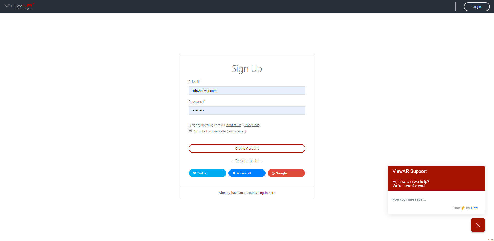

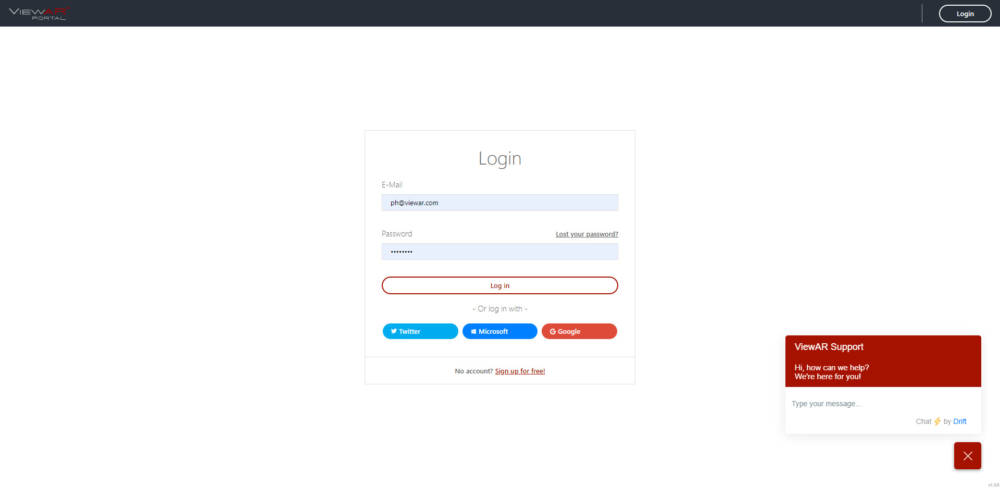

### Choose a Project
First you need to create a project. Click on “Create Project”

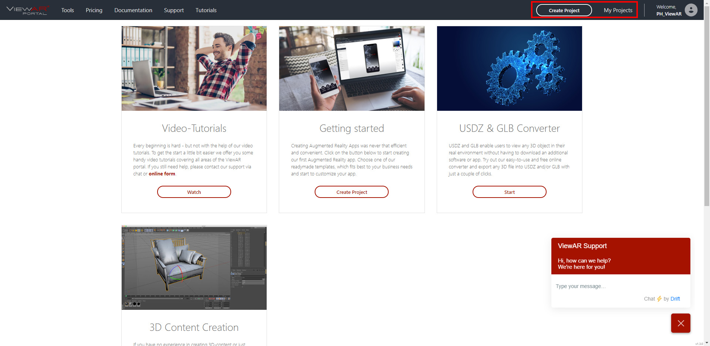

You’ll be offered with various templates to choose from. For this guide we are going to use Furniture Live as a template and use default settings for everything, you can learn more about template and app-creation here: https://documentation.viewar.com/docs/creating_apps

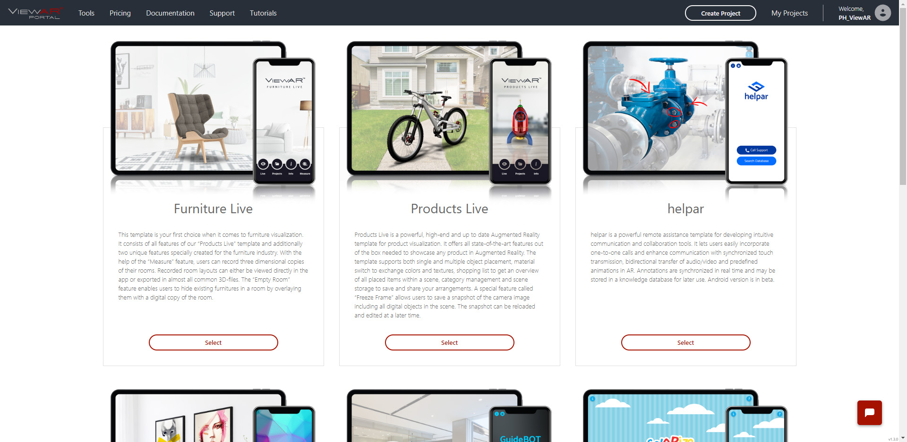

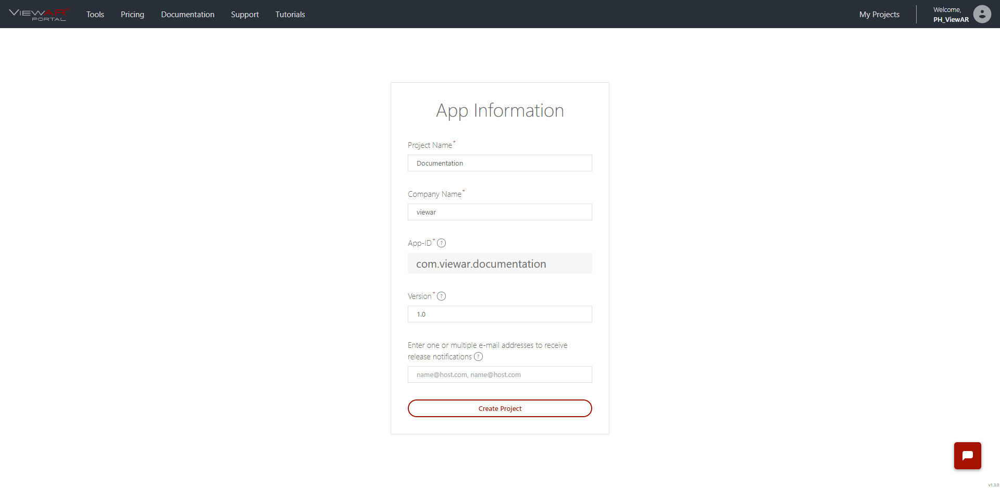

If you already created a project beforehand, click on “My Projects” to the left of your Profile Tab and click on the App-ID that you want to work with.

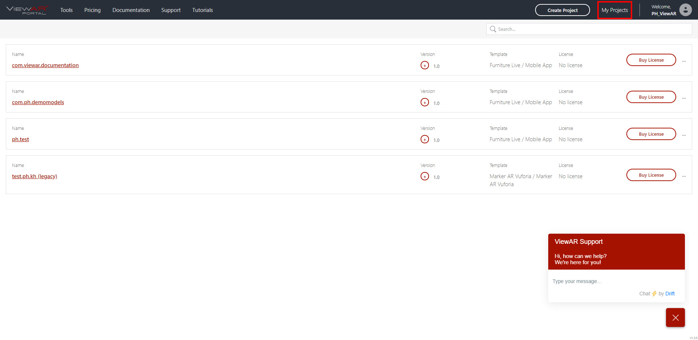

### Upload Content
Once the project you want to work with is selected, click on “Content”. You’ll find sample content in there that you can play around with.

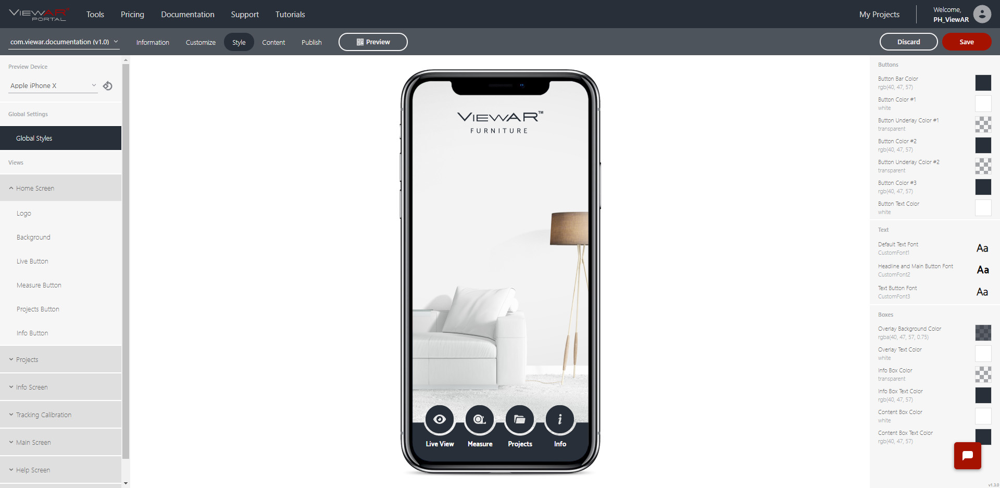

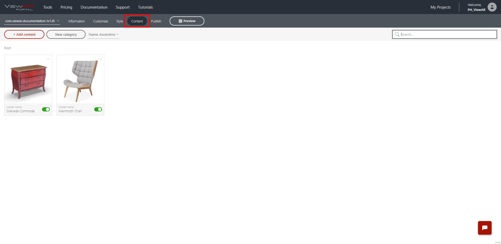

#### +Add Content
##### Upload:
You can either drag and drop your files directly into the content overview, or click “+Add Content”, drag and drop in the “Upload Tab” or click into the marked area to browse your files in the explorer”. Important: In order to upload files there needs to be a 3D file included.
Select the content you want to upload. Please make sure that your upload consists of one 3d-file only. We currently support -FBX and .OBJ file formats. You can either upload your 3D-file and textures separately or zipped in one file.
You can also upload your textures after you’ve uploaded your 3D file and update your content in a later step.

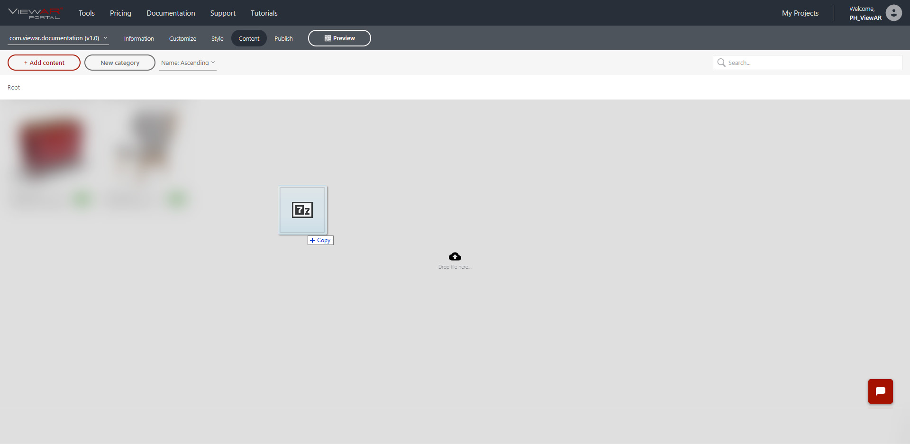

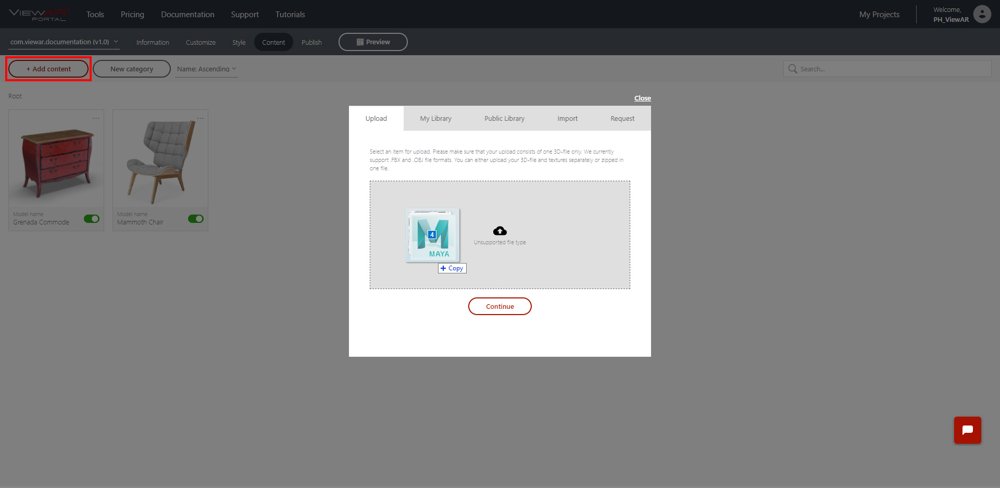

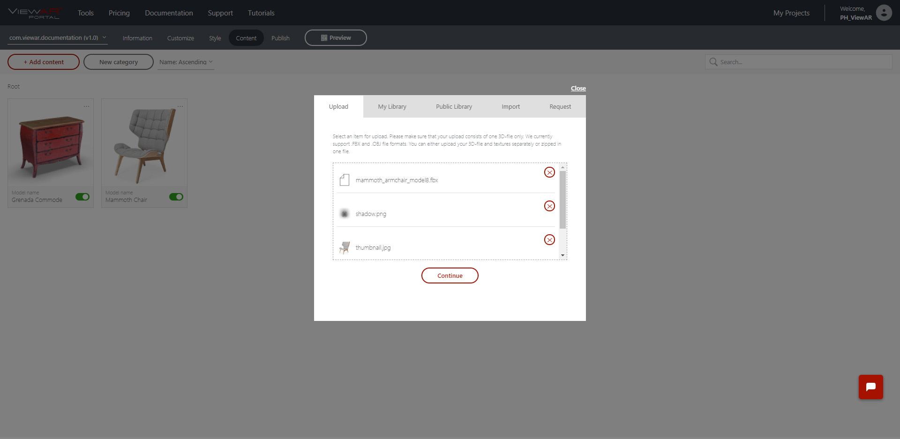

##### My Library
Here you can select all models that you previously uploaded in your account. Select the ones that you want to import into this project as well. Either scroll down the list or use the search function and click in the check boxes for the models that you want to import. Once you selected you models, click on “Import”.

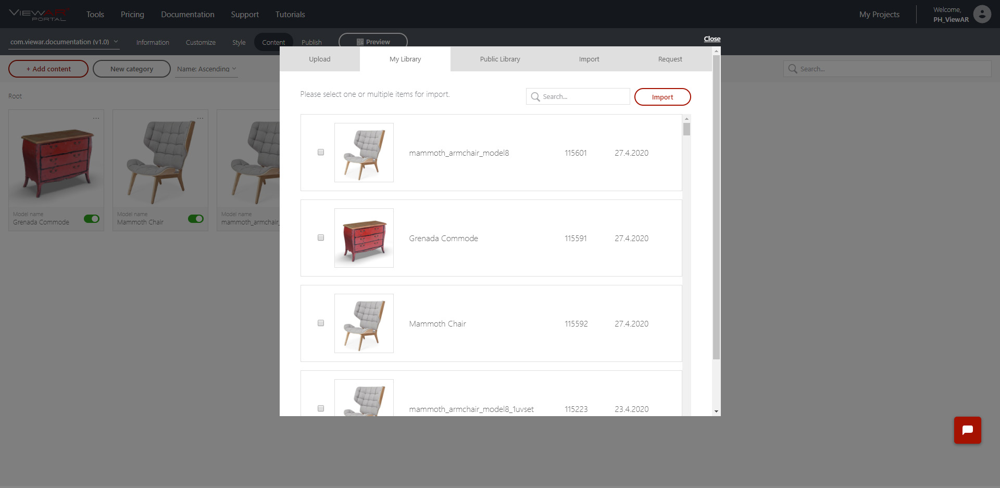

##### Public Library
Here you can find a selection of models provided by us for usage in your project.

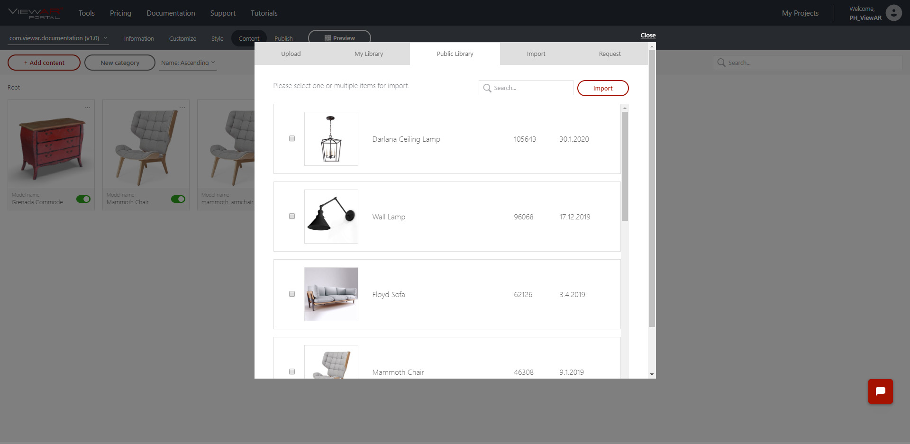

##### Import
Coming Soon

##### Request
Coming Soon

### Manage Content
After uploading the model is opened in our editor. If you want to edit models from the content overview, click on “Content”. Here you can set models to active/inactive (sets if the model is shown in your application) by clicking the slider of the model bottom right. Default is on (green, of is grey). The three small dots to the top right open a menu, where you can “Edit” (opens the model editor), “Move” your model to a different category, “Rename” your model or “Delete” the model.
You can sort the order of your models via the drop down menu to the right of “+Add content” and “New category” or search for models in the search bar on the far right.

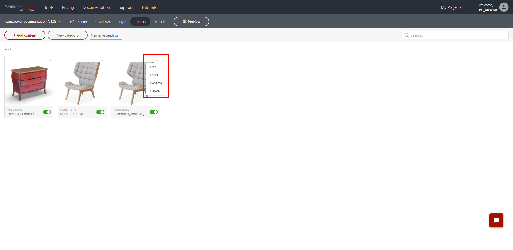

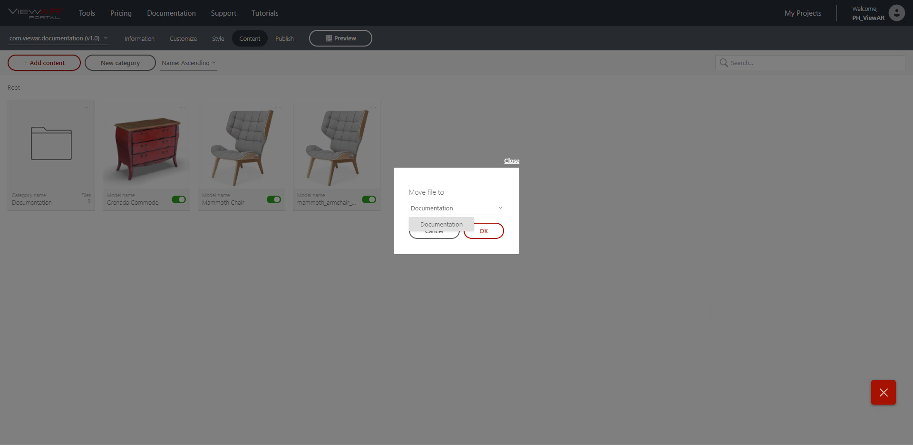

To create a new category click on “New category” and input a name. This will create a folder. You can rename, delete and move categories same as models. IMPORTANT: If you delete a category, all contained categories and models will be deleted as well.

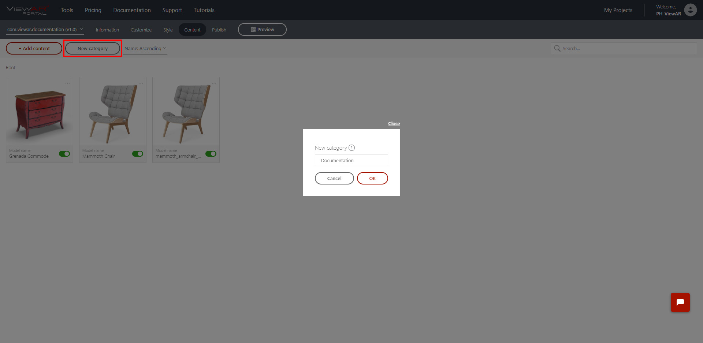

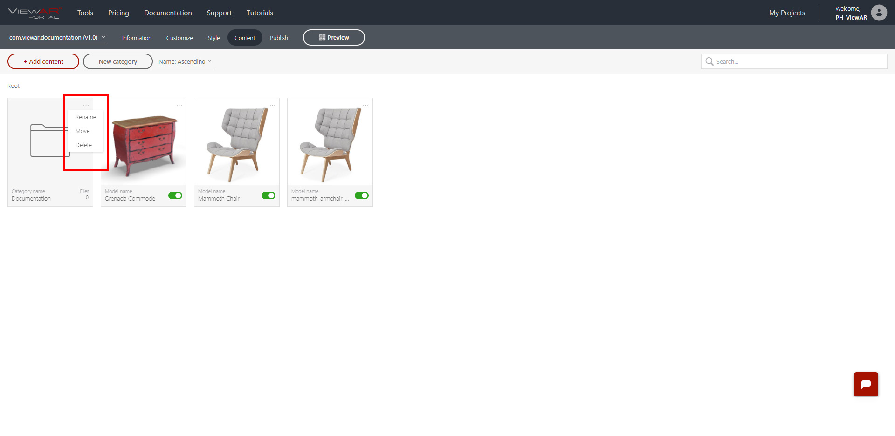

## Model Editor
### Properties
Here you define Model specific information.


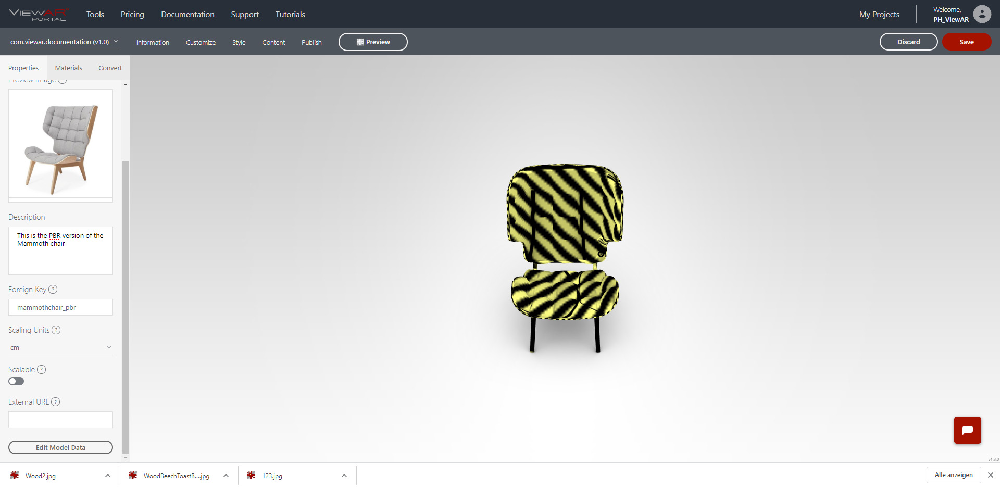

#### Name
Input the Display Name, visible in the app and overview

#### 3D-Model Update
Update your existing model files (.fbx, .obj, or .zip).

#### Preview Image
This image is used as a preview thumb within the app and in the portal content overview. You can upload the image by including it in the Model Upload (needs to be named thumbnail.jpg or thumbnail.png), drag and drop it in the box or clicking into the box and browsing for the file.

#### Description
Add a model description

#### Foreign Key
This ID is used in various external services (e.g. Shopping Cart).

#### Scaling Units
Set the same scaling unit as used in your 3D creation software. Available are mm, cm (default), m, inches, feet.

#### Scalable
Allows the model to be scaled. Default off.

#### External URL
Entering an URL activates a button in the shopping list which links to the provided URL.

#### Edit Model Data
Only use if you know what you are doing, changing anything can break the model.

### Materials
Here you can set up material properties and upload textures.

#### General Guidelines
Only enable channels that you are actually using. Only upload texture maps if necessary. Instead of uploading uniform color/greyscale maps with just one color value, consider setting the colors or values accordingly instead. If you still want to use uniform color maps, use 16x16 resolution maps.
Sliders only work within Default values (0-1), however you can set values freely, depending on the Channel, you might get broken results.
Save your changes frequently in the top right corner. If you want to discard your changes, click on discard. IMPORTANT: This resets your model to your upload state. This change can not be undone!

#### Material selection
Select the material that you want to edit. The available materials are defined in the 3D content creation and can only be changed in 3D software.

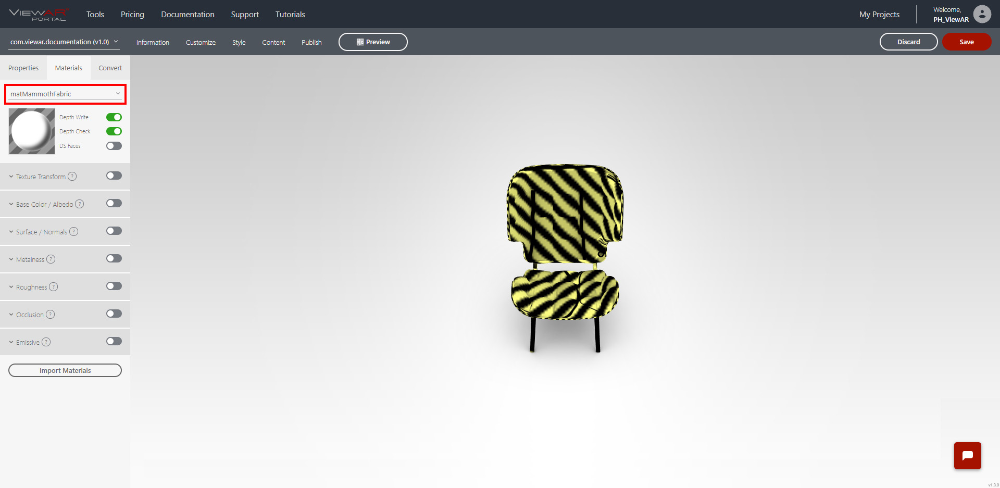

#### Depth Write
Sets whether or not this pass renders with depth-buffer writing on or not.
If depth-buffer writing is on, whenever a pixel is written to the frame buffer the depth buffer is updated with the depth value of that new pixel, thus affecting future rendering operations if future pixels are behind this one. If depth writing is off, pixels are written without updating the depth buffer. Depth writing should normally be on but can be turned off when rendering static backgrounds or when rendering a collection of transparent objects at the end of a scene so that they overlap each other correctly.

#### Depth Check
Sets whether or not this pass renders with depth-buffer checking on or not.
If depth-buffer checking is on, whenever a pixel is about to be written to the frame buffer the depth buffer is checked to see if the pixel is in front of all other pixels written at that point. If not, the pixel is not written. If depth checking is off, pixels are written no matter what has been rendered before. Also see depth_func for more advanced depth check configuration.

#### DS
Double Sided rendering enabled or disabled. Default off, on affects performance, but is useful for geometry that is not modeled double sided.

#### Texture Transform
Adjusting texture repetition/scaling as well as placement. If you want to go outside of the Slider Ranges, use numerical inputs. 

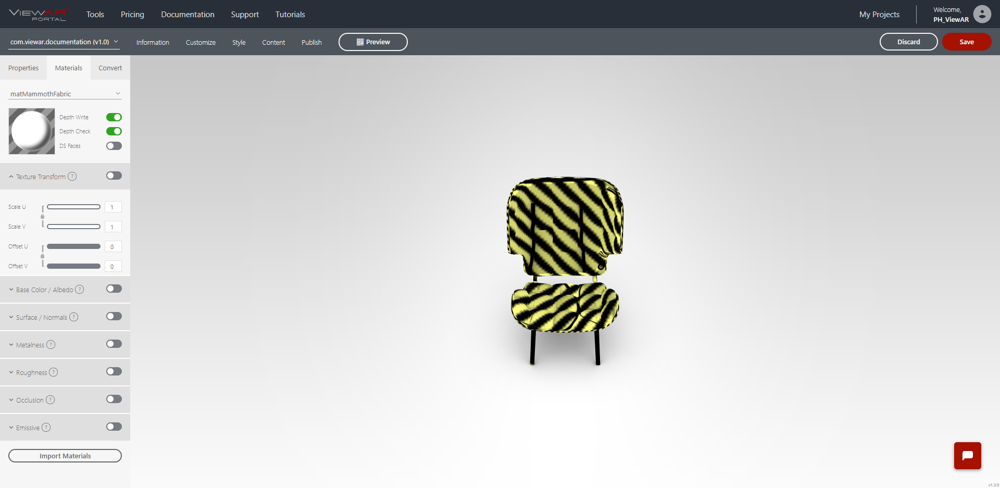

#### Base Color / Albedo
Color Information of the material. You can assign a base color or base color map, as well as the uv set and blendmode of base color and base color map.

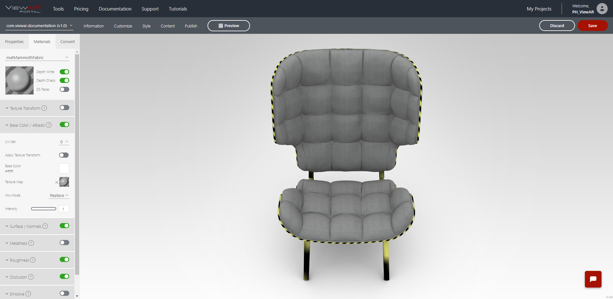

#### UV-Set:
If you have multiple uvsets, select the one that should be used by this channel

#### Apply Texture Transform
Define if the texture transform settings affect this channel or not

#### Base Color
Set the Base color without using a map

#### Base Color Map
To Choose a Base Color Map click on the sphere. The Texture Window will open up.

##### Model Textures
Here you can find textures that you uploaded with the model itself (like shadow maps, thumbnails, ambient occlusion maps. We recommend uploading textures together with the model that can not be reused and are specific to a model.
To select a texture, click on the thumbnail. To delete a texture click on three small dots in the top right of the thumbnail and select delete.
Use the item sorting or search functions if you have a lot of textures.

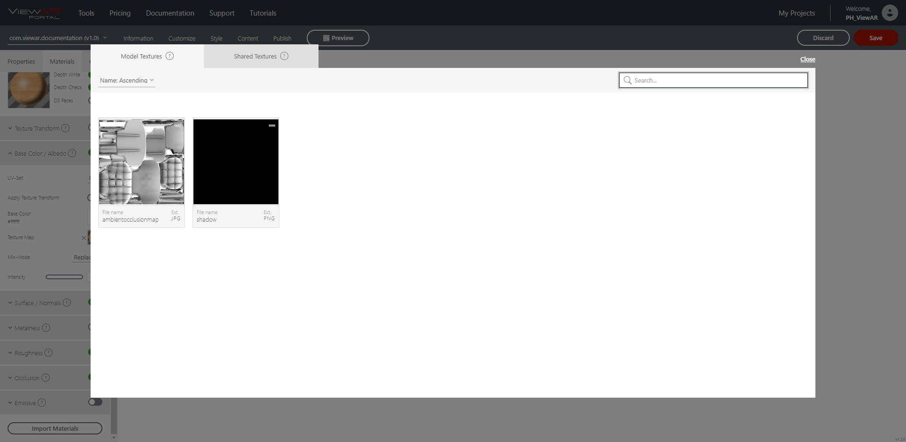

##### Shared Textures
Shared textures are shared within an account. To upload new textures drag and drop the files into the window or click on “+Upload files” to browse for it.
To select a texture to be used in the channel, click on the thumbnail. To delete a texture click on three small dots in the top right of the thumbnail and select delete.
Use the item sorting or search functions if you have a lot of textures.

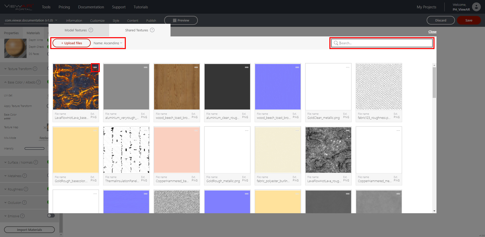

#### Mix-Mode
Defines how the Base Color and Base Color Map are mixed. Base Color Map (if used) will be on top of the Base Color. Default Mix-Mode is Replace.

#### Intensity
Adjusts the intensity of the Blending of Base Color and Base Color Map

#### Surface / Normals
For detail surface height information using normal maps.

#### UV-Set:
If you have multiple uvsets, select the one that should be used by this channel

#### Apply Texture Transform
Define if the texture transform settings affect this channel or not

#### Normal Map
Select Normal Map

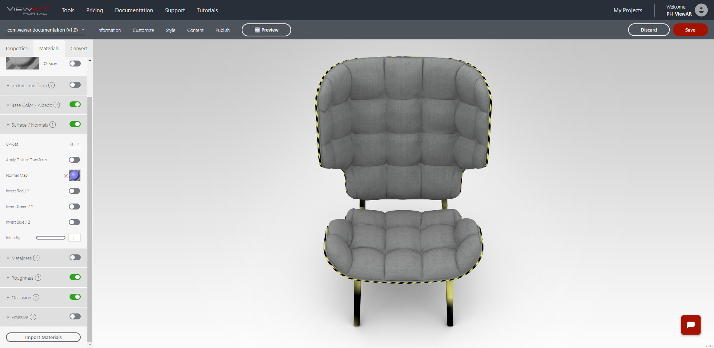

#### Invert Red/X, Green/Y, Blue/Z
Depending on how and what for Normal Maps are created, the normal orientation is different. If the Normal Map looks wrong, try inverting the channels. Usually you just need to invert the Green/Y channel.

#### Intensity
Adjusts the intensity of the Normal Map

#### Metalness
Defines whether or not the material is metallic. Either use a value or map. White is metallic (1), black is non-metallic' (0). If there are are no metallic values in your material, leave this channel disabled

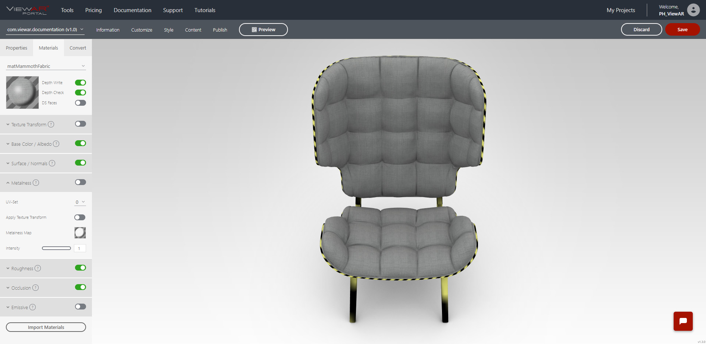

#### UV-Set:
If you have multiple uvsets, select the one that should be used by this channel

##### Apply Texture Transform
Define if the texture transform settings affect this channel or not

#### Metalness Map
Select Metalness Map

##### Intensity
Sets the Metallic value of the channel (metalness values usually are 0 OR 1 values and only in special cases something in between). If a Metalness Map is used adjusts the blending between Map and value.

#### Roughness
Defines how rough/reflective the material is. Either use a value or a map. White is rough (1), black is reflective (0).

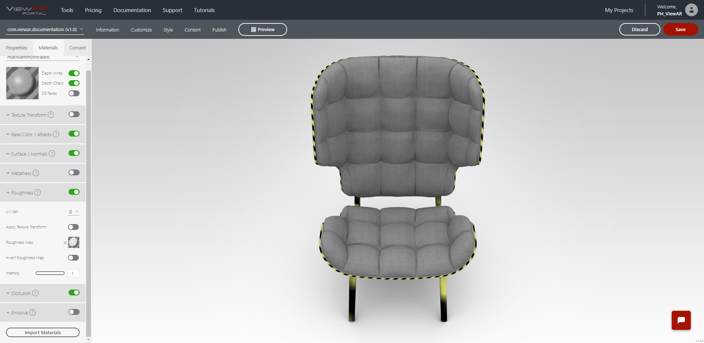

#### UV-Set:
If you have multiple uvsets, select the one that should be used by this channel

##### Apply Texture Transform
Define if the texture transform settings affect this channel or not

#### Roughness Map
Select Roughness Map

##### Invert Roughness Map
Roughness Maps are basically inverted Glossiness Maps, to reuse them, you can just invert them here.

##### Intensity
Sets the roughness value of the channel. If a Roughness Map is used adjusts the blending between Map and value. (Roughness values usually are between 0 and 1, but you can adjust the map further if you don’t get the expected result with your map).

#### Occlusion
Ambient Occlusion or Light-maps. Neutral lighting is recommended for AR usage. White is 1, Black is 0. If you don’t use an Occlusion Map, enable this channel only if you want to adjust the brightness of you Base Color Map.

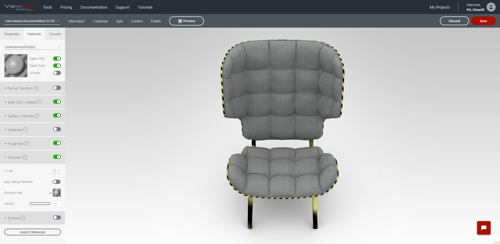

#### UV-Set:
If you have multiple uvsets, select the one that should be used by this channel

##### Apply Texture Transform
Define if the texture transform settings affect this channel or not

#### Occlusion Map
Select Occlusion Map

##### Intensity
Sets the occlusion value of the channel. If an Occlusion Map is used adjusts the blending between Map and value. (Occlusion values usually are between 0 and 1, but you can adjust the map further if you don’t get the expected result with your map).

#### Emissive
"If the material glows, set the glow with emissive color, map and/or Intensity". You can define the emissive color and intensity as well as the emissive areas in an Emissive Map. You can define the emissive color and intensity in the Emissive Channel. You can also adjust the Emissive Map with Emissive Color and Intensity Values.

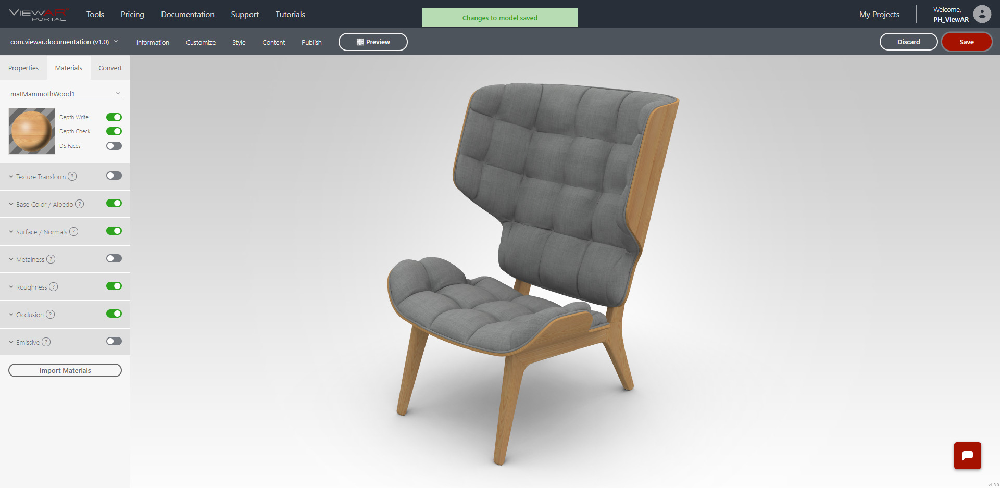

#### UV-Set:
If you have multiple uvsets, select the one that should be used by this channel

##### Apply Texture Transform
Define if the texture transform settings affect this channel or not

#### Emissive Map
Select Emissive Map

##### Emissive Color
Sets the color of the emissive material

##### Intensity
Sets the intensity of the emissive material.

#### Import Materials
If you have already set up materials in other models that have the same material names as this model, you can import the materials. Click on “Import Materials” from the bottom. A window will open where you can select the model that you want to import the materials from. Importing materials that have a different naming scheme won’t work. Once you selected the model by clicking on the check box, click “Clone Materials”

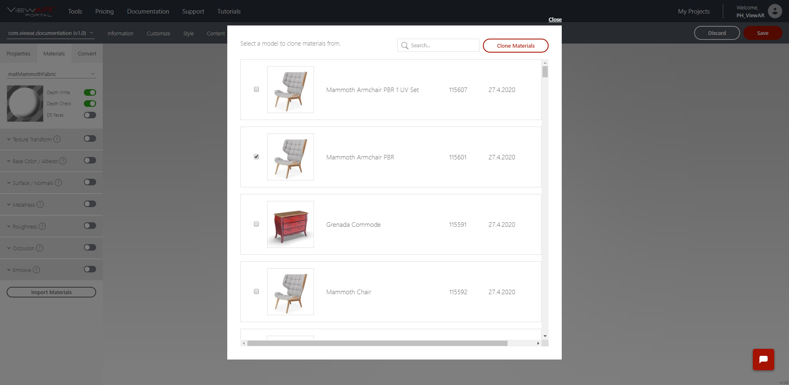

##### Save your changes
Make sure to save your changes!


### Convert
Coming soon.

## Advanced

### Custom Model Info

In the ViewAR System 3D models come with additional information such as _ID, foreign key, name, description, dimensions_. They may be accessed and edited either for each model separately \(by clicking the _Edit_ icon in the _Model List_\) or uploaded as an Excel Sheet containing multiple models information.

#### Download
An Excel Sheet containing information about models in a specific account may be downloaded using the following link: [https://develper.viewar.com/custom/universal/action:download](https://develper.viewar.com/custom/universal/action:download).

> Keep in mind that for this functionality to work, you must be logged in!

An portion of an example table:

| viewar_id |  foreign_key   |      name      |                                                   description                                                    | active | deleted |
| :-------: | :------------: | :------------: | :--------------------------------------------------------------------------------------------------------------: | :----: | :-----: |
|     1     |  johnny-bravo  |  Johnny Bravo  |     A muscular and boorish young man who tries to get women to date him, though he is usually unsuccessful.      |   1    |    1    |
|     2     |   apollo-13    |   Apollo 13    | Apollo 13 was the seventh manned mission in the Apollo space program and the third intended to land on the Moon. |   0    |    0    |
|     3     |    psyduck     |    Psyduck     |                Psyduck is constantly stunned by its headache and is unable to think very clearly.                |   0    |    0    |
|     4     | flux-capacitor | Flux capacitor |   It consists of a rectangular-shaped compartment with three flashing Geissler-style tubes arranged in a "Y".    |   0    |    1    |
|     5     |    hamster     |    Hamster     |                                                  Pure delight.                                                   |   1    |    0    |

- **viewar_id:** Unique ViewAR Identifier - make sure that you **do not change any information** in this column!

- **foreign_key:** Additional piece of identification information assigned to every model. You may use these to import a particular element in the scene (in comparison: using the model's ID would require a change very time a new model would be uploaded to the system. This way, you application may also be moved between accounts as long as the foreign key naming remains consistent).

- **name:** Self-explanatory :) Could be accessed from the app code.

- **description:** Like above, could be accessed from the app code.

- **active:** A model may be temporarily de-activated and, this way, skipped by the application (eliminates the need of code changes).

- **deleted:** Specifies whether the model has been removed from an account. If you keep your backup tables, it is also a hidden way to bring the model back from the dead ;)

> Make sure that you keep a backup copy of the sheet, so that you can restore your data if you make a mistake.

#### Batch Upload/Download

There is a way to manage information about model in a specific account through an Excel Sheet.

To download the file, log into your account and go to the following URL: [https://portal.viewar.com/custom/universal/action:download](https://portal.viewar.com/custom/universal/action:download).

You may now edit the file locally and upload it, when you're done. There is no need to keep all rows in your table - you may update only the ones which require a change. The models are recognised by the _*Model ID*_, therefore pay special attention _not to change it_!

To upload an updated file, log into your account and go to the following URL: [https://portal.viewar.com/custom/universal/action:upload](https://portal.viewar.com/custom/universal/action:upload).

### Snapping

When inserting a model in a scene, it may be useful to use another model as a reference for the new model position.

#### Example use case

To illustrate, imagine a product visualisation application, where a user is allowed to choose between different table tops. Every table top has not only different set of materials provided, but also a distinct shape and dimensions. Moreover, table legs on which those tops are to be placed also have their individual heights and shapes. Normally, in such a case, every time a switch of a table element was to be made, a set of information about the current properties of all elements would have to be retrieved and processed before a new element would be inserted. Even worse - what if the container with the table elements was moved? Or if we were to replace 20 table tops at once?

It would be helpful to make the models pull to one another. Furthermore, it would be even better to have them pull one another just in one direction, so that the table remained on the ground with the table top laying peacefully on it, instead of floating in the thin air, if a shorter leg was introduced.

#### Snappoints

The snapping settings are handled by introducing a pair of matching **Snappoints** - one in each model (one model, however, may contain multiple Snappoints, as long as they don't overlap). They are generated automatically by the ViewAR System Converter on the basis of special cubes inserted by 3D Artists in the models. It may seem tricky at first, but let us guide you through the process and it should become clear quite soon.

> The ViewAR System Converter replaces the cubes with Snappoints. It means that there is no need to worry about their visibility in the App.

Here is a list of information the ViewAR System Converter extracts from the cubes.

- **Point of Origin** \(translation\)
- **Orientation** \(rotation\)
- **Name**

##### Point of Origin

The cube's Point of Origin (stored in its _translation_ property) becomes a Point of Origin of a new Snappoint.

##### Orientation

The cube's Orientation value (stored in its rotation property) become the Orientation values of a new Snappoint.

##### Name

Here comes the tricky part, but stay with us :)

Every Snappoint has properties called _plug_ (one or more) and _socket_ (always just one).

- In order for 2 cubes to snap, one of them needs to have a plug and the other - a socket with the same name.
- A socket may only accept one plug at a time.
- Numbers of plugs and sockets don't have to match 1:1. One socket may serve multiple plugs \(e.g. table tops may be placed on one table leg\).

The cube's Name is your way of communicating to the ViewAR System Converter the Snappoint properties. Here is how it works.

A correct cube name follows the pattern below:

```json
SNAPPOINT__PLUG1_PLUG2_PLUG3__SOCKET1__SNAPPOINTNAME
```

```json
Explanation: (1)__(2)__(3)__(4)
```

\(1\) _SNAPPOINT_ - a prefix informing the converter that the mesh is a _snappoint_  
\(2\) _PLUGS_ - separated with a single underscore \("\_"\) names defining _snappoint's_ plugs. If a _snappoint_ has no plug, "dummyplug" should be inserted.  
\(3\) _SOCKETS_ - separated with a single underscore \("\_"\) names defining _snappoint's_ sockets. If a _snappoint_ has no sockets, "dummysocket" should be inserted.  
\(4\) _SNAPPOINTNAME_ - a suffix defining a _snappoint's_ name. It is not an active part of the name, just a note for 3D designers and developers.

> There is no specific maximum of snappoints, plugs, sockets, however try to keep the naming short.

**HowTo:**  
In a 3D software, open your model and create a small cube \(the cube will not be removed from the scene, therefore keep it as small as possible e.g. 1x1x1 units\). Move it to the position where the _snappoint_ is supposed to be. Then, rotate it so that the front of the cube points in the direction where other object should be snapped. _Snappoints_ need to face each other and their tops need to point in the same direction. Scaling of the _snappoint_ does not affect it's functionality. Name the cube according to the above naming convention.

IMPORTANT: DO NOT freeze the transformation or delete history of cubes. This information is needed for our converter and are essential!

You can also download a prepared snappoint here: [Snappoint.fbx](http://it5.at/trac/viewar/raw-attachment/wiki/Converter/Snappoint.fbx)

### Parametric Models

Sometimes a fixed object geometry is not enough. For example, in order to create a product customisation application where not only material finishings but also product dimensions may be adjusted, so-called **Parametric Models** would be needed. These are 3D objects which geometric characteristics may be algorithmically adjusted. This may relate to overall attributes of the object \(e.g. it’s length and width\) or properties of its elements \(e.g. radius of corners curvature\).

Let’s take an example of a plain cube with the following properties:

- **point of origin:** \[0, 0, 0\]
- **x-dimension:** \[int\], x∈ &lt;1, 20&gt;
- **y-dimension:** \[int\], y∈ &lt;1, 20&gt;
- **z-dimension:** \[int\], z∈ &lt;1, 20&gt;

Additionally, we add a numerical property describing a radius of curvature of its corners (asssumption: the curvature is symmetrical, identical in all directions and same for all corners):

- **cornerRadius**: \[int\], cornerRadius∈ &lt;0, 90&gt;

In order to use such a model in the application, one needs the following components:

- **3D Model** - created in a 3D modelling software \(e.g. Autodesk Maya\),
- **Data file** - a JSON describing the 3D Model's properties. This file is also configured in the **My Content Tab**, however, its Category needs to be set to "Data" (otherwise, the System will be awaiting a 3D model). A portion of an example data file below:

```json
{
    "dimensions": {
        "x": 10,
        "y": 10,
        "z": 10
    },
    "parameters": [
        {
            "name": "Width",
            "type": "manipulation",
            "value": {
                "default": 10,
                "max": 20,
                "min": 1,
                "type": "number"
            }
        },
        {
        "name": "Length",
            "type": "manipulation",
            "value": {
                "default": 10,
                "max": 20,
                "min": 1,
                "type": "number"
            }
        },
        {
        "name": "Height",
            "type": "manipulation",
            "value": {
                "default": 10,
                "max": 20,
                "min": 1,
                "type": "number"
            }
        },
        {
        "name": "Radius",
            "type": "manipulation",
            "value": {
                "default": 0,
                "max": 90,
                "min": 0,
                "type": "number"
            }
        }
    ],
    (...)
}
```

- **Way to access / manipulate the properties** - Values of the parameters may either be defined in the application code (e.g. one may create a parametric model of a bench being adjusted automatically to fit the length of the wall) or exposed to the user (e.g. allowing for awning width manipulation).

#### Texturing

Texturing a Parametric Model requires understanding possible modifications of the model. From the ViewAR Core side, there is a special real-time UV layout updating process implemented. Depending on which parts of the model would be stretched, the 3D object gets divided in sections with UV layouts applied accordingly. When parameters are changed, the UV layout of static parts remains untouched, while the layout of the altered elements gets regenerated in real-time. In this way, it is ensured that changes in geometry are followed by appropriate changes in the UV layout.

#### Example

A good example of the use of Parametric Models is the [Markilux App](https://www.viewar.com/showcase/markilux/).

> Development and integration of parametric models is a complex issue, therefore we strongly encourage you to use our support on that matter. Custom 3D objects may be requested via the [Request 3D Model Form](https://portal.viewar.com/jobs/add).

### Configurations

In order to create complex scenes with model interdependencies encoded, we use **Configurations**. Technically speaking, a Configuration is a JSON file defining logical rules of model properties or possibilities of loading sets of models into the scene.

Below an example of a portion of configuration defining geometry options for a table top:

```js
{
    "configuration": {
        "properties": [{
            "name": "Table_top",
            "type": "part",
            "valueType": "enumerated",
            "values": [{
                    "name": "Table top - Round",
                    "foreignKey": "table-top-round"
                },
                {
                    "name": "Table top - Rectangular",
                    "foreignKey": "table-top-rectangular"
                },
                {
                    "name": "Table top - Square",
                    "foreignKey": "table-top-square"
                }

            ]
        }]
    }
}
```

and a portion of configuration defining material options for that table top:

```js
{
    "configuration": {
        "properties": [{
            "name": "Table_top",
            "type": "material",
            "valueType": "enumerated",
            "values": [{
                    "name": "White Marble"
                },
                {
                    "name": "Pink Marble"
                },
                {
                    "name": "Decorative Concrete"
                }
            ]
        }]
    }
}
```

### Reference Models

When creating complex objects taking up a lot of memory, it is a good idea to split them into lighter portions and, instead of inserting them all in one model file, provide a list of references to the group of smaller models. Such an entity is called a **Reference Model.**

Technically speaking, it is a JSON file, providing references to models which are to be downloaded. Each one is identified through a unique ID \(UID\).

> The order of the list is used as an order of download. In case of less efficient internet connections, it may result in object appearing one by one. You may want to keep it in mind and, for example, build up a tall building from the bottom to the top.

Below is a snippet of a Reference Model file.

```json
{
    "converter": {...},
    "meshes": {
        "skyscraper-groundfloor": [],
        "skyscraper-mainbody": [],
        "skyscraper-spire": []
},
    "references": [
        {
            "UID": "1",
            "name": "skyscraper-groundfloor",
            "pose": {
                "orientation": {
                    "w": 1,
                    "x": 0,
                    "y": 0,
                    "z": 0
                },
                "position": {
                    "x": 0,
                    "y": 0,
                    "z": 0
                },
                "scale": {
                    "x": 1,
                    "y": 1,
                    "z": 1
                }
            },
            "version": "1",
            "type": "environment",
            "foreign_key": ""
        },
        {
            "UID": "2",
            "name": "skyscraper-mainbody",
            "pose": {
                "orientation": {
                    "w": 1,
                    "x": 0,
                    "y": 0,
                    "z": 0
                },
                "position": {
                    "x": 0,
                    "y": 0,
                    "z": 20
                },
                "scale": {
                    "x": 1,
                    "y": 1,
                    "z": 1
                }
            },
            "version": "3",
            "type": "environment",
            "foreign_key": ""
        },
        {
            "UID": "3",
            "name": "skyscraper-groundfloor",
            "pose": {
                "orientation": {
                    "w": 1,
                    "x": 0,
                    "y": 0,
                    "z": 0
                },
                "position": {
                    "x": 0,
                    "y": 0,
                    "z": 90
                },
                "scale": {
                    "x": 1,
                    "y": 1,
                    "z": 1
                }
            },
            "version": "1",
            "type": "environment",
            "foreign_key": ""
        }
    ]
}
```

### Animations

Add animations to models or their parts. You will be able to access them through the JavaScript API, controlling their speed, number of iterations and triggering actions.

## Guidelines for content creation

In order for a model to be available in a ViewAR Application, it needs to be uploaded to the ViewAR System. In this section we will lead you through the process and give you some tips on performance optimisation.

### Modelling

#### Scene Setup

> First and foremost: The ViewAR System is using a [Left-handed Cartesian Coordinate System](../additional_information/left-hand-coordinate-system.md). Please verfiy your export settings before uploading any models!

Furthermore, you can work with any unit you like but in real-life scale. Default units that we use are _cm_, therefore, if you are using different units, remember to apply a correct scale setting when uploading the model.

#### Naming Conventions

> Don't use any special characters (only an underscore "\_" is allowed for mesh-, material-, texture- and filenames).

Also, try to keep naming patterns short, simple and meaningful. For your own's sake :\)

#### File Formats

The ViewAR System accepts polygon models in 3D files formats of _.fbx_ and _.obj._

#### Polycount

The ViewAR System can handle objects and scenes with up to 800k Tris, however, it also depends largely on the platform/device which is going to be used. An older iPhone or iPad won't be able to handle such a high polycount model, while the Web version would still have a good performance.  
Refer to the following examples of well-optimised models with Tri-Count, plus a suggested maximum for similar assets:  
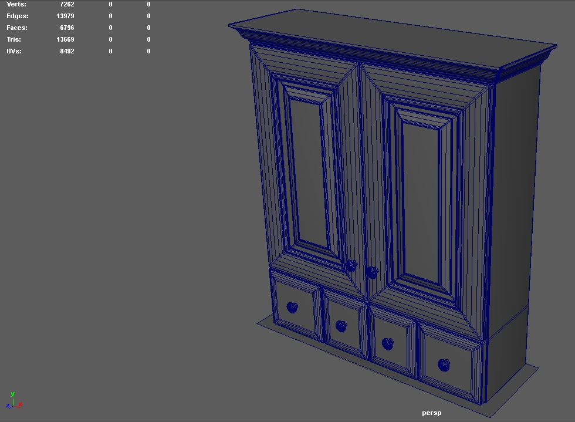  
Keep in mind that this cabinet's interior is also modelled. Simple hard surface objects, like cabinets, don't need a lot of polygons to look good. Try to keep it below 50k triangles.  
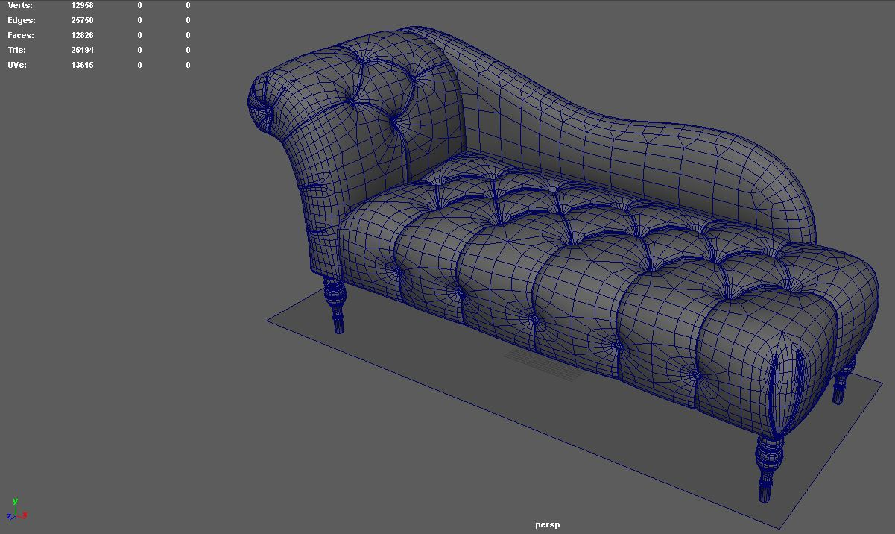  
For complex geometries, like the sofa above, use polygon density differentiation. Try to stay below 200k Triangles. If needed, try baking smaller into the ambient occlusion map.  
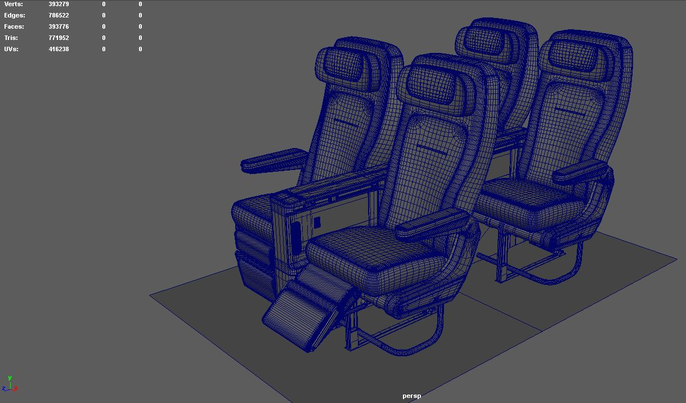  
Sometimes even more complex models are needed, be aware that this can cause performance problems and crashes with older platform.

#### Polygon Distribution and Edgeflow

Always try to keep your models optimised and avoid unnecessary subdivisions. A higher polygon density makes sense on detailed surfaces, such as folds, seams, round shapes etc, but not on flat ones. More Polygons, if they support the shape, less if they don’t the shape should be still looking good in close-up.

It makes sense to model elements like seams or stitches in such a way that you can better hide uv-cuts.

A good edgeflow can significantly improve shading and make objects easier to edit/adjust/fix/improve. Try using bevels for hard edges, as they improve shading and baking of maps, at the same time having the same performance impact as hard edges \(the vertices get split up in the rendering engine either way\). Furthermore, try to model with _quads_ if possible and turn to \_tris \_as a last resort only. Triangulation may fix issues mentioned below, however, they may make future adjustments hardly possible. In any case, keep a copy of your quad-models before triangulation.

A chair, that is used somewhere in an architectural building, also doesn't have to be as detailed as a chair that is the main asset in the presentation.

#### Don'ts

- **no** faces with more than four sides \(triangles and quads only, quads preferred\)

- **no** concave faces

- **no** faces with holes

- **no** non-manifold geometry

- **no** lamina faces

- **no** zero length edges

- **no** zero geometry area faces

All of those can, but don’t necessarily have to cause issues for the converter/app.

> in Autodesk Maya: Select Object -&gt; Hold Shift -&gt; Hold Rightclick -&gt; Clean Up

#### UV Unwrapping and Layout

- Use Checker Textures to test your models texture distribution

- As little as possible texture distortions \(patterns might be used\)

- As little as possible texture cuts \(Try to hide UV Cuts in the geometry, inside folds for example\)

- We use a two uvset workflow. The first uvset \(uv0\) for tiled textures which can be overlapping and the second \(uv1\) for ambient occlusion or other maps that have to fit in the uv 0-1 space without any overlapping faces. Textures should be scaled by scaling the uvs in uv0 or later when setting up materials in our material editor.

UV0:  


UV1:  


- Pixel Density should be consistent for tiled textures \(they still need to be sharp at closeup\)

- The recommended pixel density for the tiled uv layout is 20 pixels/cm for a resolution of 1024x1024\).

- Pixel Density should be optimized for ambient occlusion map \(invisible/hard to see surfaces don’t need as much texture space\)

- The UV Unwrap and Layout process differs a lot between 3D softwares. The basic guidelines and workflow however stay the same.

> All faces need UVs! Otherwise parts or the whole model would be invisible. Even if you don't plan on assigning any textures, make sure to map UVs. A planar map without regards to unwrap and layout would suffice in that case.

The advantages for this workflow are very visible in the images below. While the objects look very similar in quality from far away, once you get up close the difference is massive. Even with tiled 256x256 textures you can get a lot better results up close. It's also easy to switch out the tiled textures to create coloroptions without the need to add more large textures, rebake them or edit them in Photoshop.

Baked textures are supported as well, but for the best results we highly recommend to use the 2 UV Set workflow. You can use this workflow with non-overlapping UV Layouts as well as long as you duplicate the UV Layout into a second UV Set, however this is just a workaround for our system since we expect 2 UV Sets for layered textures.

**Left**: Baked Textures; **Right**: Tiled Texture with AO Map 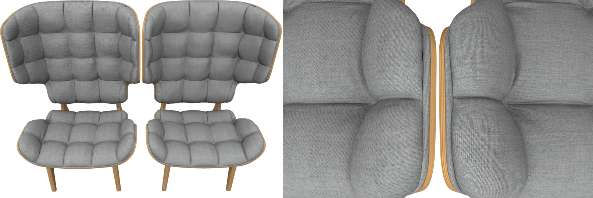

#### Naming Convention

Use meaningful names for the mesh-names without special characters. Underscore "\_" is allowed.  
Naming is also important for our converter that reacts to specific prefixes:

"SHADOW\_\_" or "UNBOUND\_\_" will disable collision in the app, which is useful for shadowmaps \("SHADOW\_\_shadowmap"\) for example. That also means that you won't be able to touch that mesh and rotate it in the app.

### Materials

- Make sure to assign materials to surfaces which should later be set up in the _Material Editor_.
- At this point, our converter only supports Phong and Lambert, therefore, if you set up different shaders, for example vray, all your settings will be lost and the conversion may fail.
- If you want to set up Textures beforehand, read more about it in the [FBX Setup Tutorial](http://wiki.viewar.com/pages/viewpage.action?pageId=1179802%29).
- If you want to set up your Textures beforehand, read more about it in the [FBX Setup Tutorial](http://wiki.viewar.com/pages/viewpage.action?pageId=1179802%29), what requirements we have in order for it to work with our converter.

#### Dos

- For solid materials use a JPG file format \(file extension should be _.jpg_, not _.jpeg_\).
- For transparent one: PNGs.
- Always use power-of-two resolutions \(16/32/64/128/256/512/1024/2048/4096\). A non-power-of-two resolution will be up-scaled to the next level and hurt performance without better quality. 4096 is the highest supported resolution.
- Tiled textures should be no larger that 512x512 or 1024x1024, baked maps should be 1k or for more complex assets 2k. The resolution high enough for close up. A good default is a 512x512 tiled texture for 50cm², however, it largely depends on object use - an architectural building needs different pixel density than a chair.
- Keep the data size of textures in mind. Uncompressed textures are much larger and rarely is the increased size worth the cost. The difference between a maximum quality _jpg_ and "10" quality _jpg_ is not visible, however, the difference in size is obvious. Especially, when multiplied by the number of used textures in the scene.

#### Donts

- No special characters!

### UV Setup

#### Autodesk 3DsMax

For this guide we are going to work through a very simplified version of our workflow. The steps are usually the same, but how you unwrap will be different with more complex objects.

First step is to create a uvlayout and unwrap in order for the texture to be visualized properly. Add an "Unwrap UVW" modifier.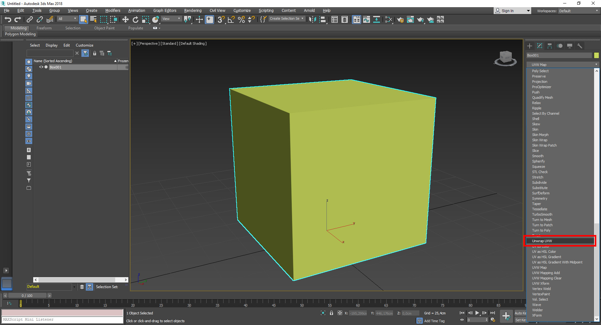Open the UV Editor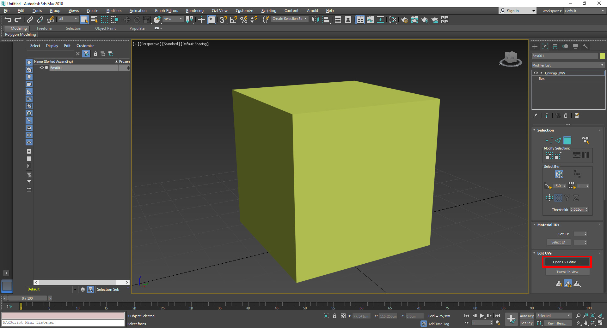Select the object and use the appropriate projection \(we are going with the simple Box Map here\) and unwrap \(quick peal here\)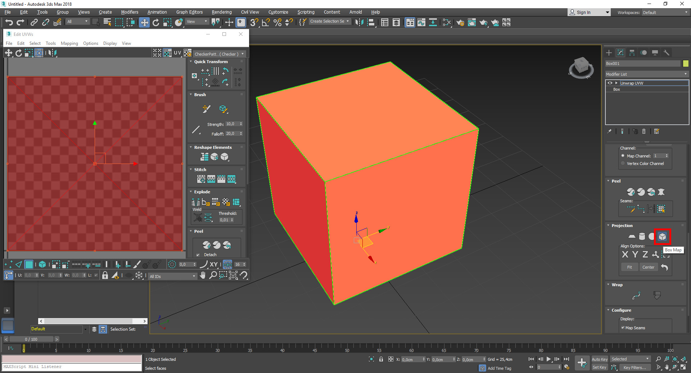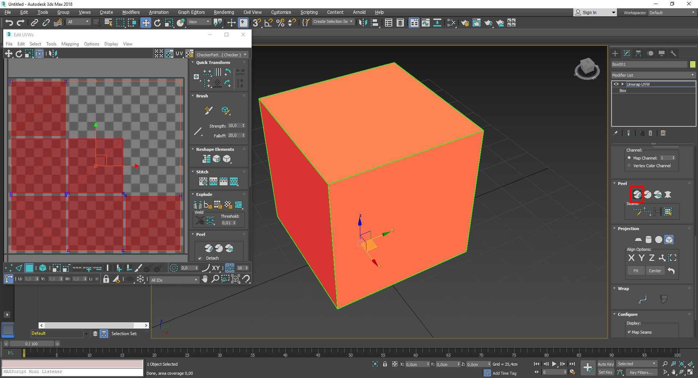Make sure that all uvshells have the same pixel density \(we recommend 20pixels/cm @1024x1024\) or scale the uvs to your texture needs \(rather than scaling the texture in the texture settings, since will be ignored in our converter\). You can later scale the textures in our material editor as well.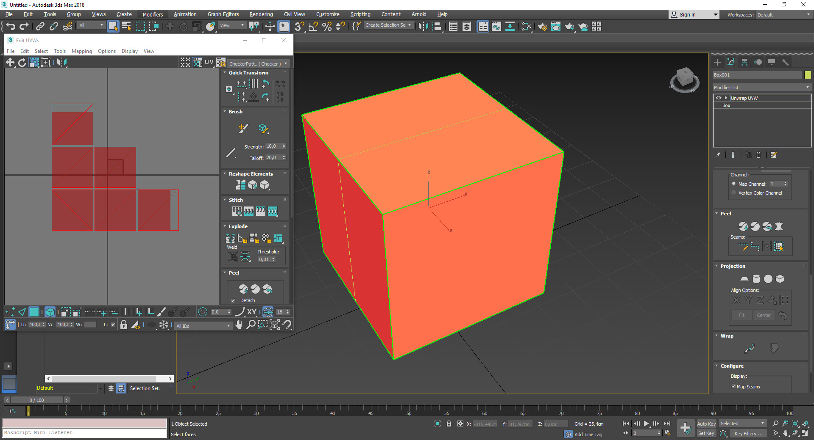The first UV Set \(uv0\) is usually used for tiled textures which can have overlapping UVs. For the ambientocclusionmap.jpg we need a non-overlapping UVset and hence need to create a second one \(uv1\). For this we can save the already created UVs so we can load it in uv1 or we can just create an new uvset. Either way we need a second Unwrap UVW Modifier. After you created the second modifier we need to assign it to the second uv channel \(uv1\). A pop up will appear with a channel change warning. Click abandon, then either load saved UVWs or create a new non-overlapping UVW unwrap.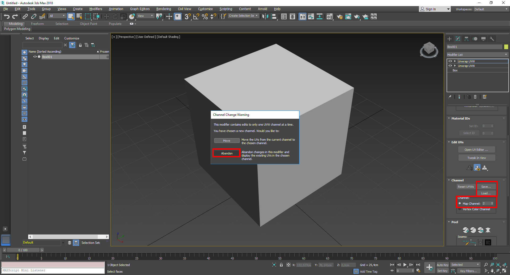The next step is to create and assign materials to your object as well as link the maps to both the proper channels as well as UV Set. Click "M" to open the material editor. Open up the "Maps" dropdown menu, check Ambient Color \(you might have to click on the small symbol on the right\) and Diffuse Color then click on "No Map" to link the textures. In to next pop up choose "Bitmap" and assign your diffuse textures and ambientocclusionmap.jpg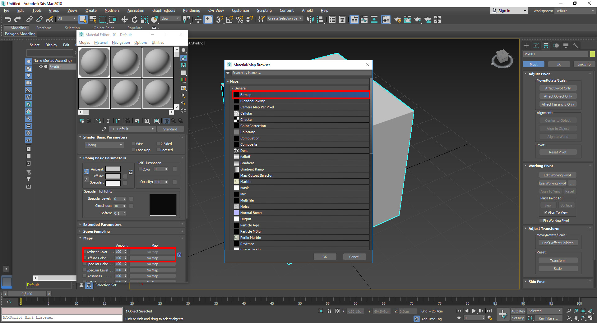The materialeditor then changes to the "texture level" where you need to assign the proper UV Channel. To get back to the "material level" use the small icon called "Go To Parent". After linking all textures properly you are ready for export.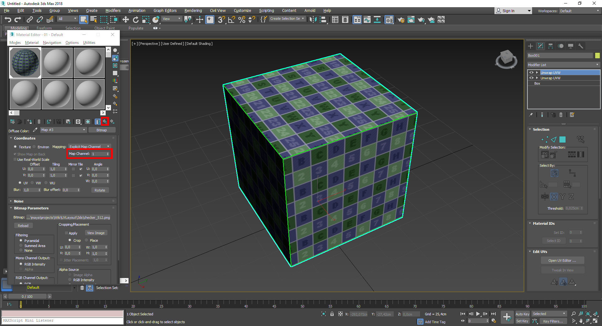

#### Autodesk Maya

First create a UV Layout for your object with your preferred uv mapping workflow. Unfold and unwrap it.[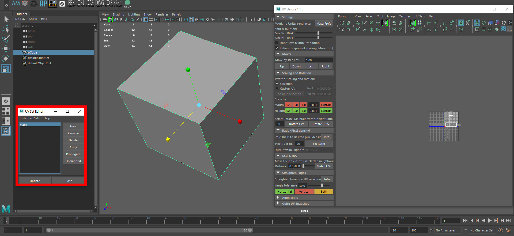](https://viewar.gitbooks.io/sdk-documentation/content/assets/uvlayout1.jpg)The first UV Set \(following called uv0\) is used for tiled texture. Scaling textures should be either done by scaling the uvs of uv0 or within our material editor settings. We recommend using 20pixels/cm at a resolution of 1024x1024 as a standard for uv0. Once all UV shells have consistent pixel density, duplicate uv0, either by using the "copy" function in the UV Set Editor or in the UV Editor by selecting the UVs and then using Polygons-&gt;Copy UVs to UV Set-&gt;Copy into New UV Set.[](https://viewar.gitbooks.io/sdk-documentation/content/assets/uvlayout2.jpg)  
[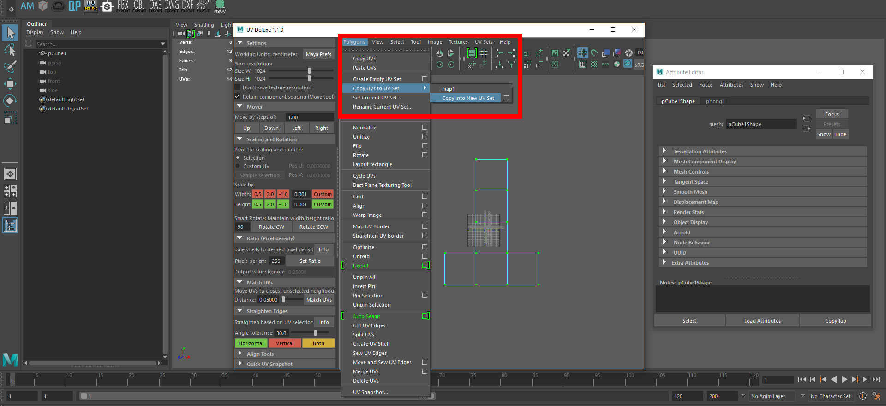](https://viewar.gitbooks.io/sdk-documentation/content/assets/uvlayout3.jpg)Once this is done, lay out the UVs in the second UV Set \(following called uv1\) in an optimized fashion, using as much of the texture space as possible. Hard to see or hidden parts of the UV Layout should be scaled down to not waste texture space.[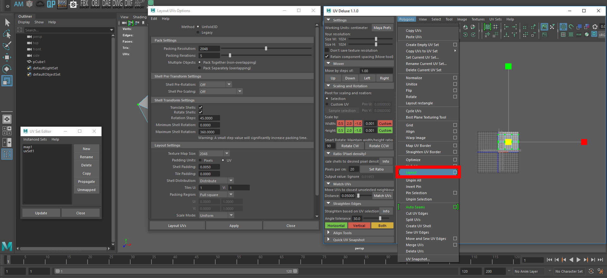](https://viewar.gitbooks.io/sdk-documentation/content/assets/uvlayout3unfoldLayout.jpg)Next assign a new material \(Lambert/Phong recommended\). Link the required tiled texture to the diffuse color channel and the ambientocclusionmap.jpg to the ambient color channel. To do that click on the checkered box on the right of the channel in "Common Material Attributes", chose "File" and then browse for your texture. In general the texture should be in the same Folder as the fbx that you'll export.[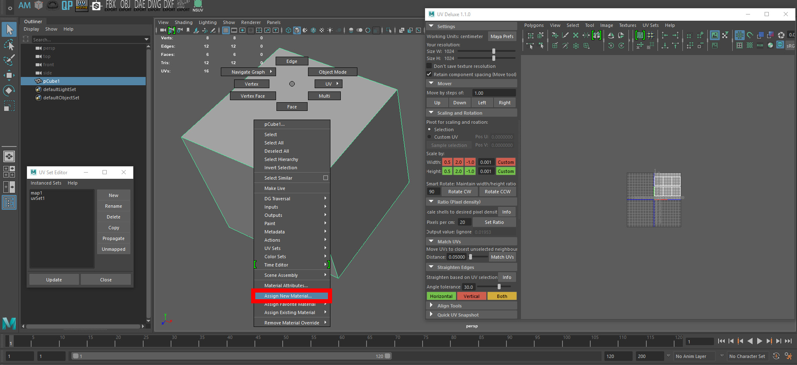](https://viewar.gitbooks.io/sdk-documentation/content/assets/uvlayout5.jpg)[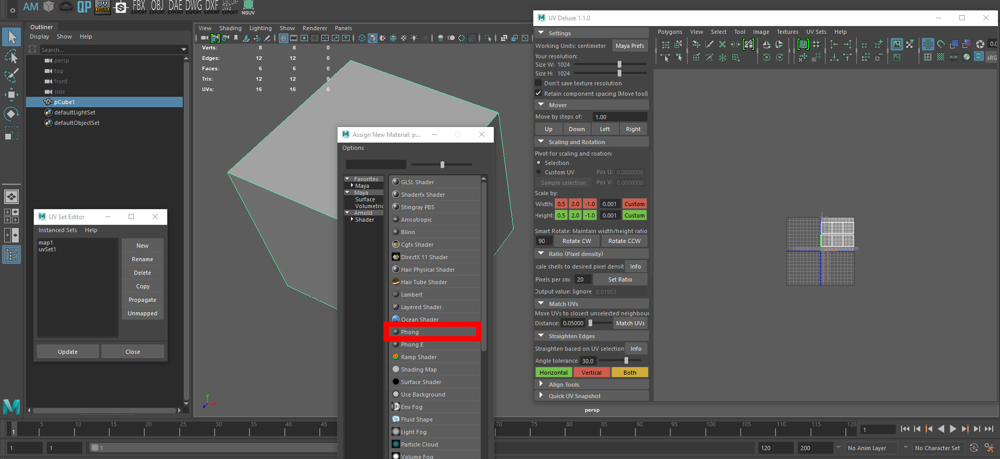](https://viewar.gitbooks.io/sdk-documentation/content/assets/uvlayout6.jpg)[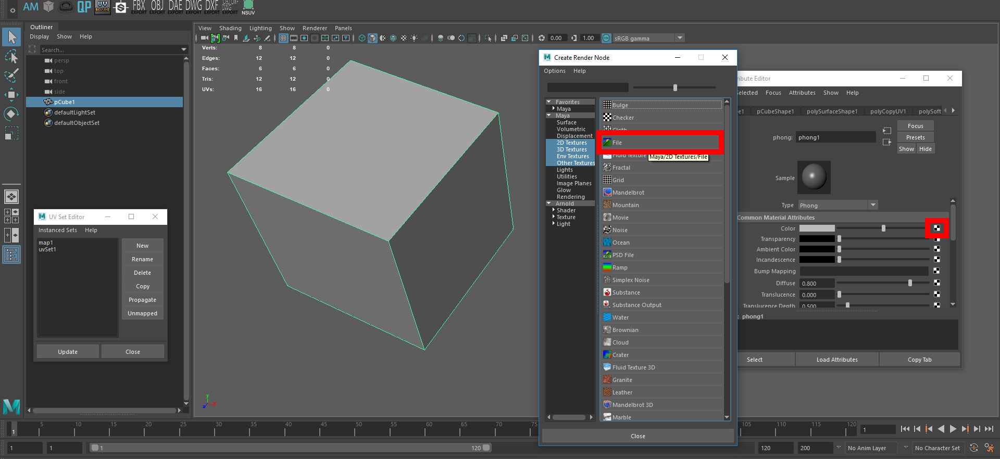](https://viewar.gitbooks.io/sdk-documentation/content/assets/uvlayout6_2.jpg)[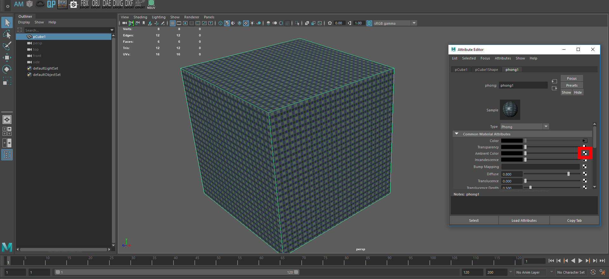](https://viewar.gitbooks.io/sdk-documentation/content/assets/uvlayout8.jpg)[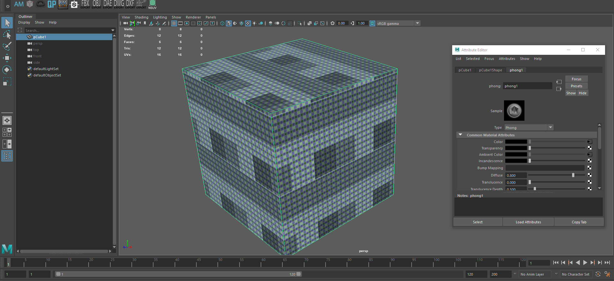](https://viewar.gitbooks.io/sdk-documentation/content/assets/uvlayout9.jpg)You will notice that the ambient occlusion map is not properly layout out. All textures are using uv0 as default. To fix this we have to link the right UV Set by clicking on the mesh, holding "Shift" and the right mouse button and select "UV Linking" in the opening Menu.[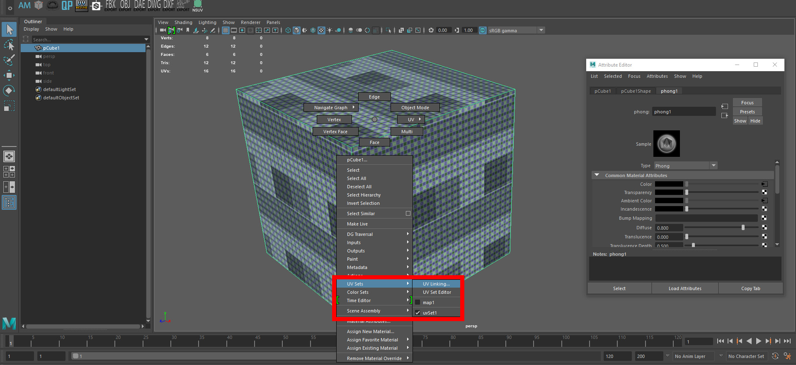](https://viewar.gitbooks.io/sdk-documentation/content/assets/uvlayout10.jpg)[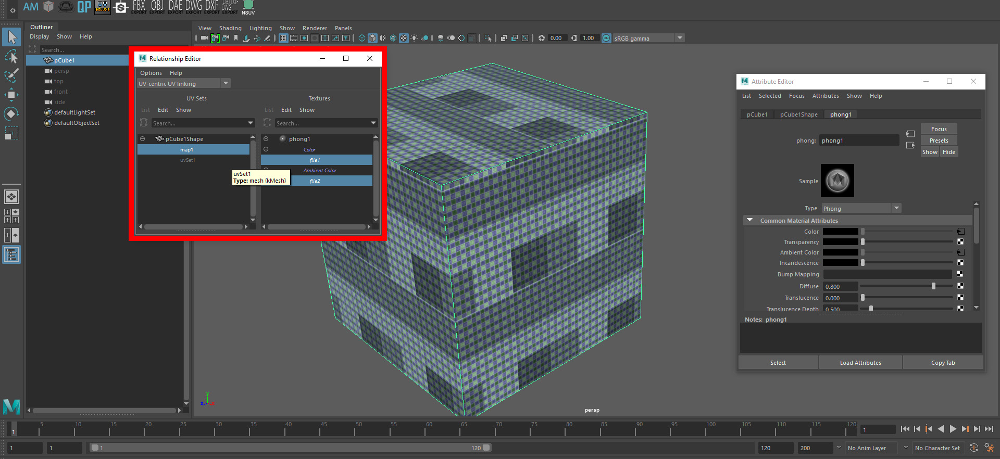](https://viewar.gitbooks.io/sdk-documentation/content/assets/uvlayout11.jpg)Notice how in "map1" - our uv0 - both maps are selected on the right side in the Relationship Editor.

Click on uv1 \("uvSet1" in the picture\) and then click on the proper texture file \(here "file2"\) to assign the texture to the right UV Set.[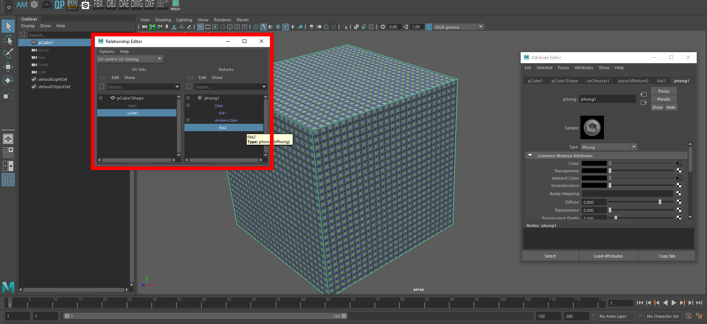](https://viewar.gitbooks.io/sdk-documentation/content/assets/uvlayout12_2.jpg)You are now ready to export your model as an fbx. Put all necessary files into an archive in a flat structure and upload it in our system. Your model is now ready to go for further edits in our system. For more details look in the according entries of this Gitbook.

You can find the sample content here: [UVLayout.zip](https://www.dropbox.com/s/jsxmpsmhvmg8sh5/UVLayout.zip?dl=1 'UV Layout')

#### Maxon Cinema 4D

1. Create or load any 3D-object(s) into your scene

2. Change the layout to "UV Edit" and switch to "UV Polygons Edit Mode" in the icon palette.

3. This step is not necessary but will help you to make optimal use of texture space. If you are familiar with the procedure you can skip it. Switch back to "Standard" layout and add a "Connect Object" from the toolbar to the object manager and drag your objects onto it. Open a new texture view (Window > New Texture View...). Drag& drop the "Connect Object" onto the new texture window and lock it. This window displays now all UVs overlapping and their changes in the original UV Mesh Editor Window.

4. Make sure that the UV is shown in the "UV Mesh Editor Window" (UV Mesh > Show UV Mesh). Select an object from the "Render Viewport" and apply an optimal UV mapping method from the "UV Manager".

5. After unwrapping the meshes you need to create copies of your objects. Simply drag&drop the UVW-tags from the copies to the corresponding objects and delete the copies. Now every object has an additional UVW-tag available. Cinema4D always uses the first UVW-tag for the baking process, so nothing to do here. The second UVW-tag is used for the tileable texture. To set it up just select the UVW-tag and apply an optimal UV mapping method from the "UV Manager" (the UV should cover the whole texture window).

6. Switch back to "Standard" layout. To bake an ambient occlusion map for all objects in the scene we need to connect them to one single object. Select all objects in the object manager, right click and choose the option "Connect Objects". Select the new created object and start to set up the UV-layout for the ambient occlusion map (Objects > Bake Objects...). In the "Bake Object" window activate the following options: Ambient Occlusion, Keep UVs and Single Texture. Change the resolution to 1024 x 1024 pixels and set the file format to "JPEG". After baking the object Cinema4D will automatically duplicate the connected object. Delete all the connected objects and the new created material in the "Material Manager". In case you used the "Connected Object", drag&drop the objects out of it and delete it.

7. As we said before, Cinema4D always uses the first UVW-tag for baking the ambient occlusion map. On the contrary to the ViewAR engine, which uses the second UVW-tag for the ambient occlusion map. Therefore we have to switch the order of the two UVW-tags for all objects, so that the second one contains the UV-layout for the ambient occlusion map and the first one the UV-layout for the tileable texture.

8. Export your scene in the FBX file format (File > Export... > FBX... (\*.fbx))

9. Rename the image file of the baked ambient occlusion map to "ambientocclusionmap.jpg" and ZIP it together with the FBX-file of your 3D scene.
10. Login to the [ViewAR Delevoper Portal](https://portal.viewar.com/user/login). Go to the 3D model upload page (Content > 3D Models > +Upload new model).
    Fill out the form (Name, Foreign Key, etc.) and drag&drop the previously created ZIP-file onto the "Model bundle" input field and press "Upload".

11. After pressing the "Upload" button the ViewAR Material Editor opens automatically.

### Ambient Occlusion Maps

Ambient Occlusion Maps or Light Maps are very important for good looks in our app and in real-time applications in general, since real-time/dynamic shadows or real-time ambient occlusion generation has a huge impact in performance. Ambient occlusion also helps a lot to bring out the shape and details of objects and you can use high-poly versions of your object to generate a more detailed AO map as well. Without AO or lightmap objects look very flat.

Things that are important for good quality ambient occlusion maps:

The most important one is an efficient and clean uv layout, with no overlapping uv shells and proper texture-space usage. To optimize and make the best use of your texture space, you should scale up shells that are easily visible and the ones that are hardly visible down. I've you have symmetrical objects or parts that are used multiple times, it can make sense to place those shells on top of each other \(as long as the lighting conditions are the same\) and you can upscale small shells to fill out empty texture-space.

On the rendering/baking side you should make sure that you bake with enough samples and as little as possible noise. It may look good in renderings, but uv-cuts will be a lot more visible that way. It is also a good idea to bake in a higher resolution than the one that you will use. You can always downscale the resolution.

Ambient occlusion has no real light information and are essentially just contact shadows on the object. They already improve the visual quality a lot, but creating a neutral light setup will improve the look even more. You have to keep in mind that in our app you can see objects from all directions, if you create for example one directional light from the front, it will look very much out of place when you place it in a room that has light coming from the other side. The best compromise is creating a light dome from the top and another from below that emits less light, so that the bottom parts are still lit, but darker.

Baking engines that use rays and not vertex normal directions generally give the better result, because uv-cuts are invisible or close to it. Many bakers like xnormal and the otherwise good bakers from Substance Designer produce very visible uv-cuts.

Another thing to note: If you have animated parts of the object, you probably have to explode the model before baking, because shadows that are out of place look a lot worse than shadows just not being there. Let's take a door with frame for example. If you bake it in closed position and then the animation opens the door, the contact area on the frame and door will be completely black and very visible. It's a compromise to bake them separately, but it is the better result.

#### Substance Designer:

Very good baker, that takes long in high settings and produces visible uv-cuts. Since SD is still in very active development, that might change in the future, there already have been improvements in that regard. Substance Designer is also very cheap compared to dedicated 3D software or render engines and a very powerful texturing tool.

#### Marmoset Toolbag:

Has a very good and fast ambient occlusion baker that produces close to no visible uvcuts. Make sure to use a high enough ray count for good result \(I generally go with 2048 rays for the final version, 64 samples and in 8k resolution. Resizing for in app usage is always done after baking\). It is also very fairly priced and the real-time rendering engine is also impressive.  
As of now the baker always uses the first uv set \(you might have to switch the uvsets for the baking process in your 3D software\) and even if you don't have a proper High Poly object you need to place a mesh \(duplicate in this case\) in the High Poly group. Make sure to delete all shadow maps or possible decals. You should adjust the cagefile to the mesh with the slider, if you are using the same mesh for the baking, set it to 0.001

[https://www.marmoset.co/posts/toolbag-baking-tutorial/](https://www.marmoset.co/posts/toolbag-baking-tutorial/)

#### Vray:

Vray produces - with the right settings - by far the best results. There are plugins for a lot of 3D software, but they are expensive. If you need it just for baking, you are better off with Marmoset Toolbag 3.

[http://www.laurenscorijn.com/articles/ambient-occlusion-baking](http://www.laurenscorijn.com/articles/ambient-occlusion-baking)

#### 3ds Max

[http://www.laurenscorijn.com/articles/ambient-occlusion-baking](http://www.laurenscorijn.com/articles/ambient-occlusion-baking)

#### Maya & Turtle Renderer

First step in Maya is to enable the Turtle Renderer Plug-in. For this go to Windows-&gt;Settings/Preferences-&gt;Plug-in Manager and open it. Scroll down and check the boxes for the Turtle Plug-in.[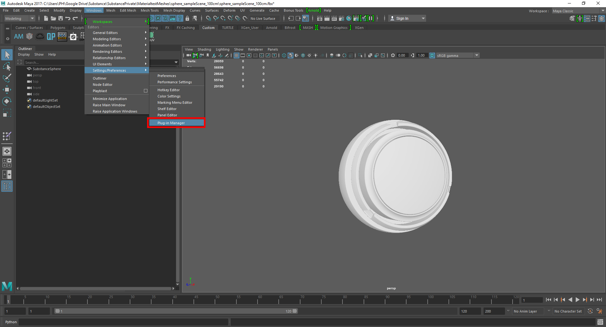](https://viewar.gitbooks.io/sdk-documentation/content/assets/Turtle1.jpg)[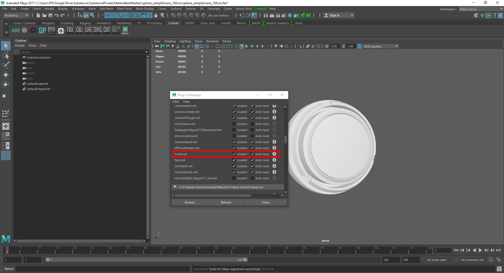](https://viewar.gitbooks.io/sdk-documentation/content/assets/Turtle2.jpg)Assign a plain white lambert to the object to be baked. Select the model, hold "Shift" and the right mouse button then select "Assign New Material" in the opening menu and choose lambert.[](https://viewar.gitbooks.io/sdk-documentation/content/assets/Turtle3.jpg)[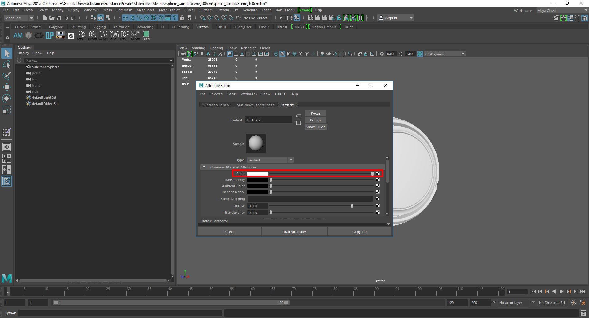](https://viewar.gitbooks.io/sdk-documentation/content/assets/Turtle4.jpg)Open up the Render Settings and select the Turtle Renderer.[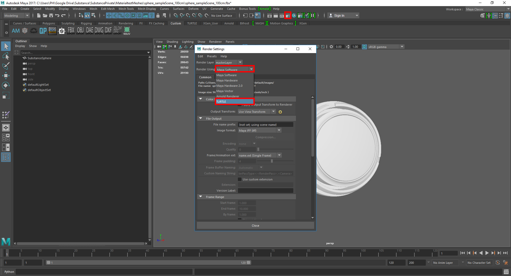](https://viewar.gitbooks.io/sdk-documentation/content/assets/Turtle5.jpg)Go to the Turtle Tab, change the Render Type to Baking.[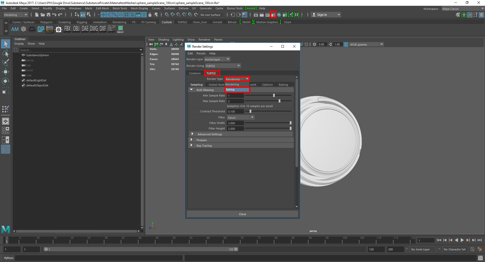](https://viewar.gitbooks.io/sdk-documentation/content/assets/Turtle6.jpg)Move on to the Global Illumination Tab and Enable Global Illumination. Depending on your needs you can adjust the render settings to your liking, but we will stick to the basics for now.[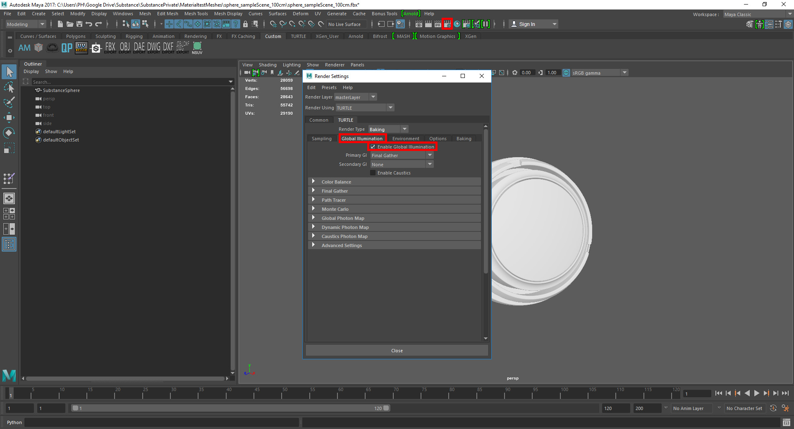](https://viewar.gitbooks.io/sdk-documentation/content/assets/Turtle7.jpg)Go to the Environment Tab and choose Sky Light for both "Environment and GI Environment". Set the "Sky Color" to plain white for a neutral result.[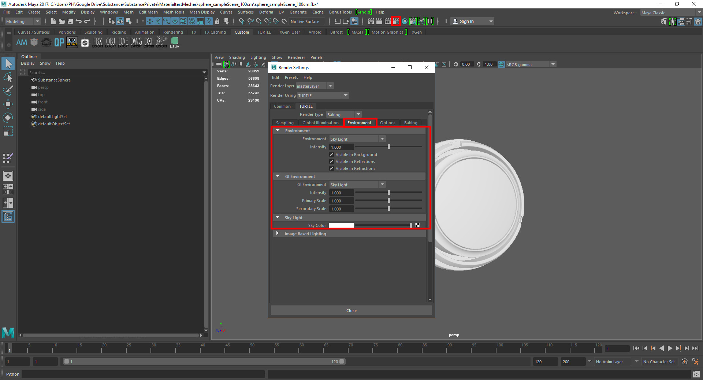](https://viewar.gitbooks.io/sdk-documentation/content/assets/Turtle8.jpg)Go to the "Baking" Tab and check the box "Bake selected surfaces"[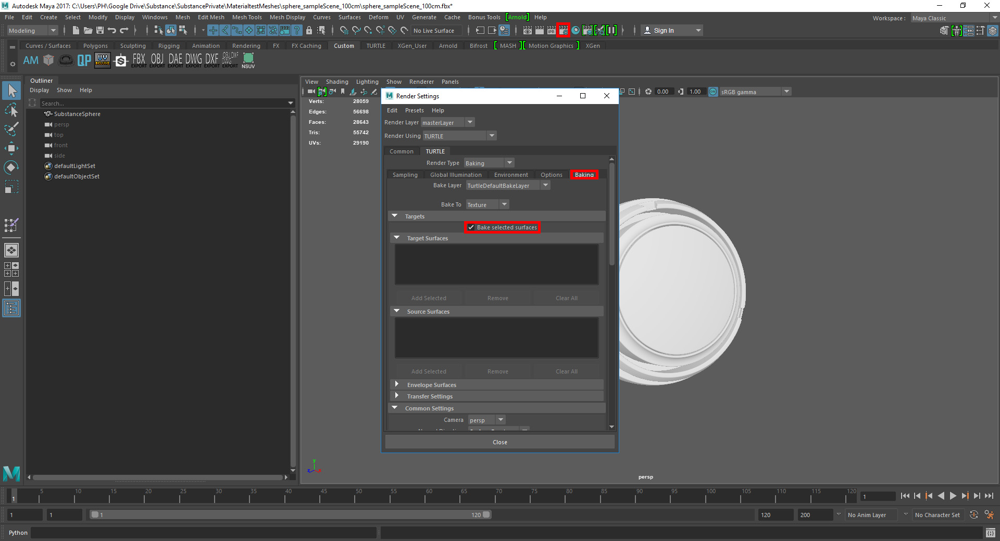](https://viewar.gitbooks.io/sdk-documentation/content/assets/Turtle9.jpg)Scroll down to the Common and Texture Baker Settings. Here you set up the resolution of your bake, the edge dilation width, how and where your maps are saved and if the bakes \(when you have multiple objects in one uvset\) should be merged into one map instead of multiple. Here you also need to set which UV Set should be baked, if you have multiple.[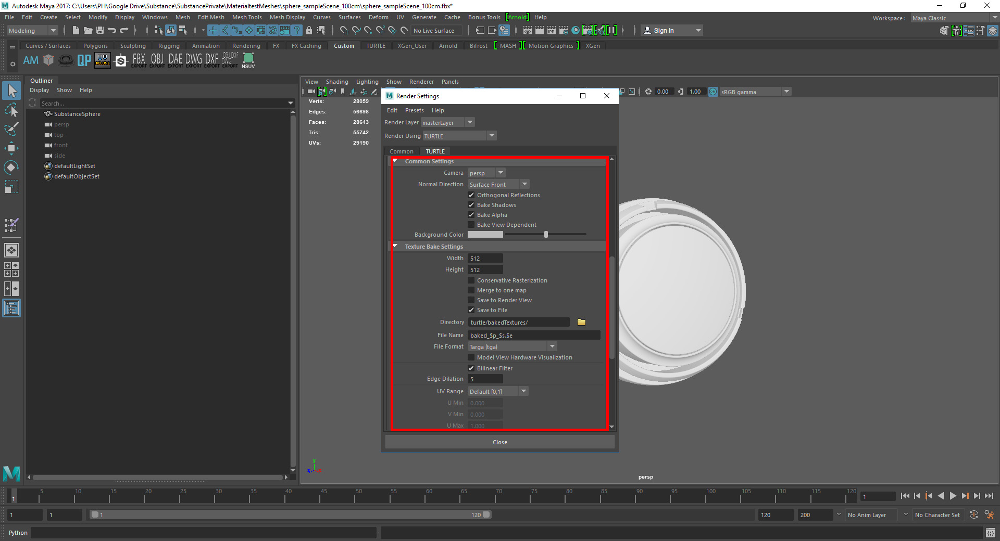](https://viewar.gitbooks.io/sdk-documentation/content/assets/Turtle10.jpg)Scroll further down and only check "Ambient"[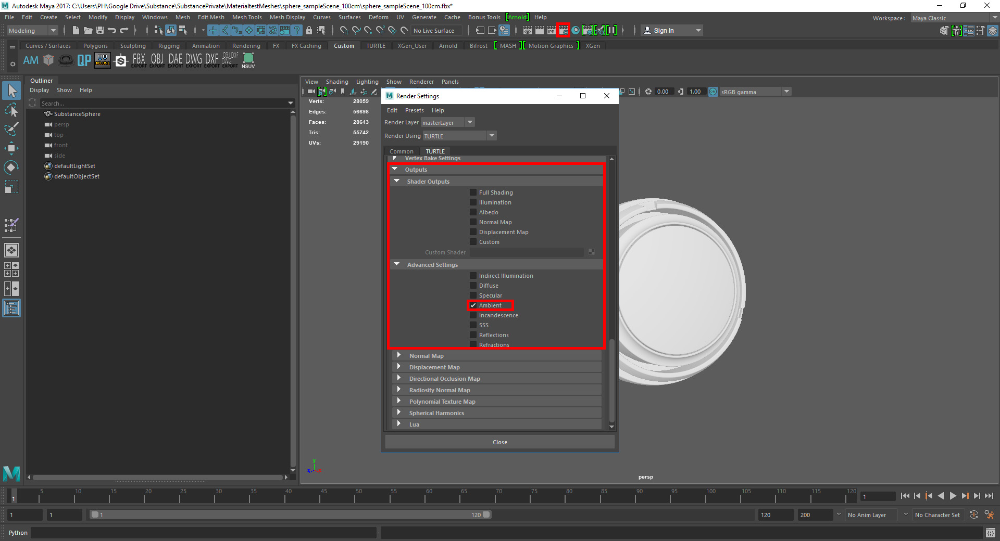](https://viewar.gitbooks.io/sdk-documentation/content/assets/Turtle11.jpg)With everything set up, select the model, open the Render View and Render. You can either look up the results in the folder you set up before or just save the image from this view.[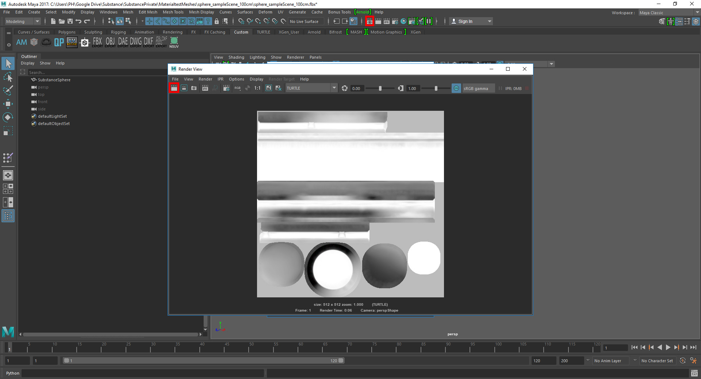](https://viewar.gitbooks.io/sdk-documentation/content/assets/Turtle12.jpg)To review the result assign the ambientocclusionmap.jpg to the color channel of your material.[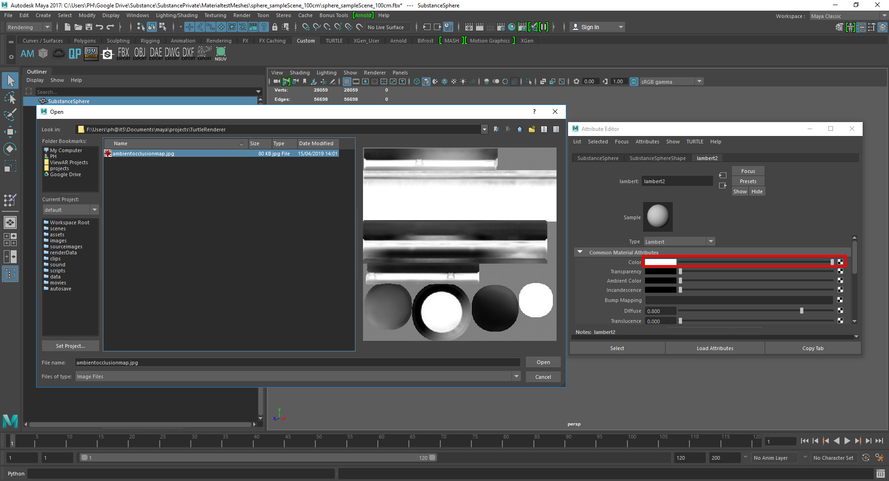](https://viewar.gitbooks.io/sdk-documentation/content/assets/Turtle13.jpg)The quality and rendertime is highly dependent on your the settings and resolution that you use for the bake. For the final result I suggest baking at a higher resolution and then reducing the image size after.[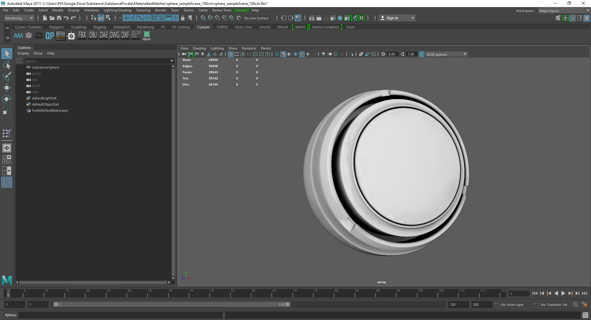](https://viewar.gitbooks.io/sdk-documentation/content/assets/Turtle14.jpg)

#### Maya & Arnold Renderer

Open a Scene with the model that is supposed to be baked.[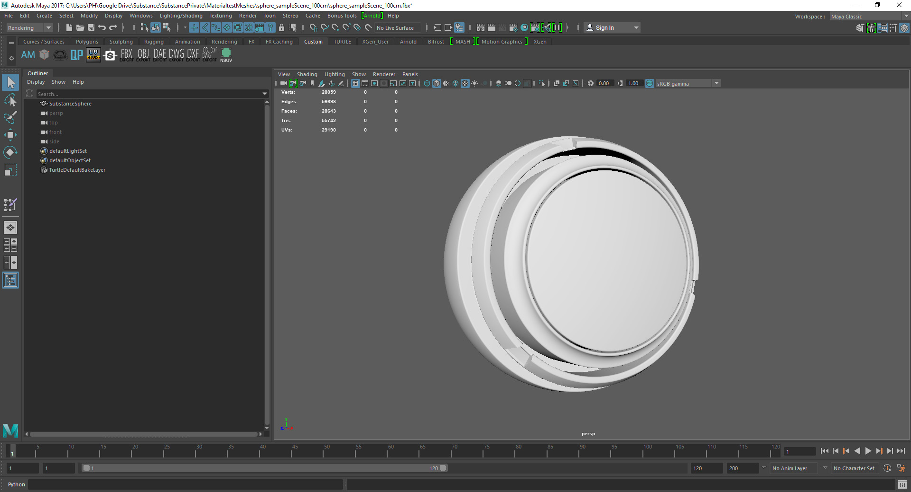](https://viewar.gitbooks.io/sdk-documentation/content/assets/Arnold1.jpg)Select the model, hold "Shift" and the right mouse button then select "Assign New Material" in the opening menu.[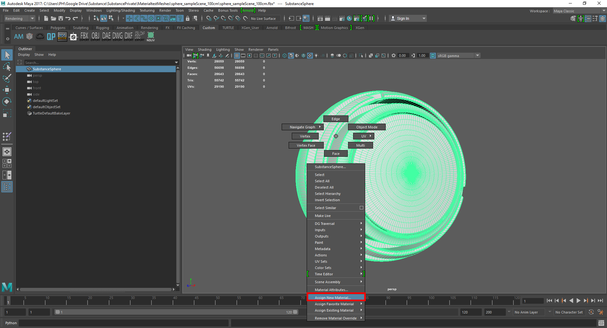](https://viewar.gitbooks.io/sdk-documentation/content/assets/Arnold2.jpg)In the new window click on "aiAmbientOcclusion" to assign the Arnold specific ambient occlusion material.[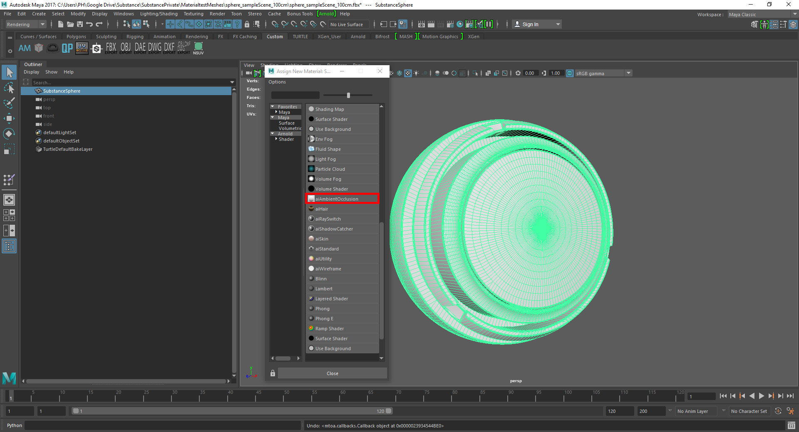](https://viewar.gitbooks.io/sdk-documentation/content/assets/Arnold3.jpg)In the Attribute Editor you can adjust the properties of this material for different looks. We'll leave it at the standard settings for now. The most important one however are the samples. Those have the biggest impact on the quality and render time of the bake, 6 samples should be enough for most cases.[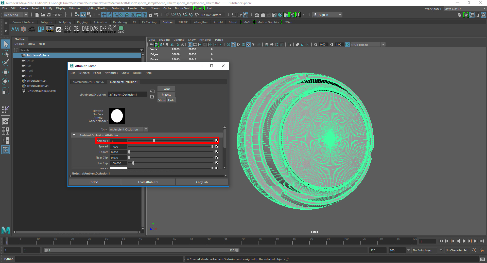](https://viewar.gitbooks.io/sdk-documentation/content/assets/Arnold4.jpg)Make sure that the model is selected and then in the menu go to "Arnold"-&gt;"Utilities"-&gt;"Render Selection To Texture"[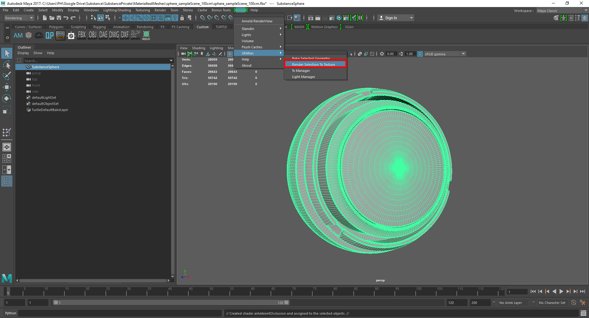](https://viewar.gitbooks.io/sdk-documentation/content/assets/Arnold5.jpg)If you have a newer version of Maya/Arnold than I \(Maya 2017\) then the pop up will look like the picture below and you can skip a couple of steps that I'm going through later. Make sure to select an output folder, set the resolution you need and that the "Extend Edges" box is checked. This is important to fix black lines at the UV cuts. The resolution and Camera Samples have a high impact on both quality and render times. If you have multiple UV Sets input the name of the UV Set without overlapping, if it's the first UV Set leave it empty.  
[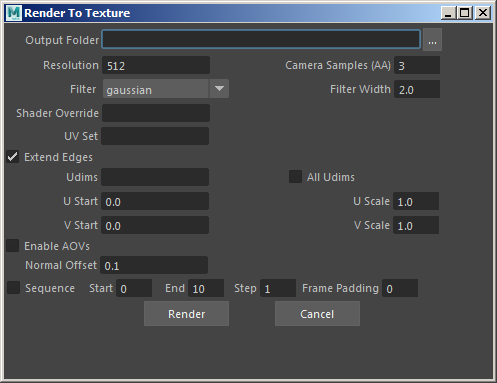](https://viewar.gitbooks.io/sdk-documentation/content/assets/newerArnold.png)  
Arnold can only output ".exr" files when you are rendering textures, so before using it in our system you have to convert it to jpg.

The steps below are needed if you have an older Maya/Arnold version. The Render To Texture window is a lot reduced and most importantly the "Extend Edges" feature is missing producing bad texture seams. You can also only bake the first UV Set, so make sure it's non-overlapping.[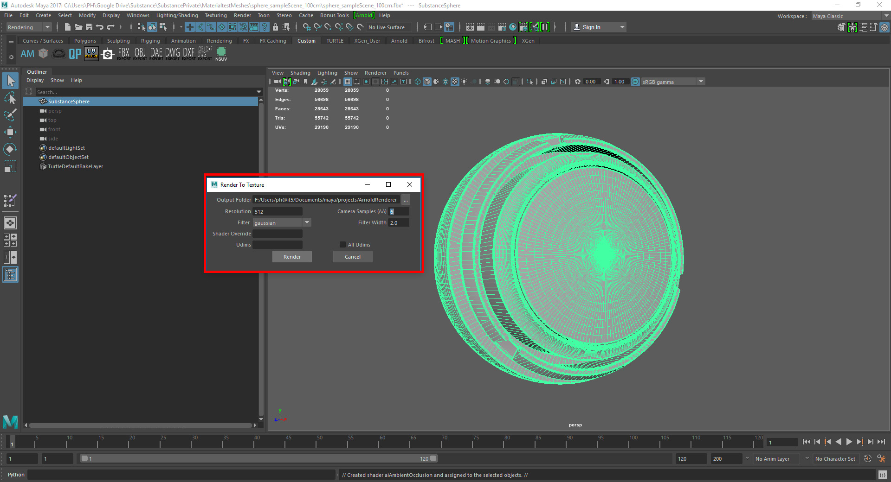](https://viewar.gitbooks.io/sdk-documentation/content/assets/Arnold6.jpg)To fix the texture issues in the baked map download "xNormal" here: [https://xnormal.net/](https://xnormal.net/)  
xNormal is a free tool with a lot of functions, but in this case we only need the Photoshop plugins it provides.  
Install x-normal and the Photoshop tools. Open the baked .exr in photoshop and choose the "As Transparency" option.  
[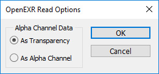](https://viewar.gitbooks.io/sdk-documentation/content/assets/Arnold7.jpg)  
Next either export it as ".png" or use the quick-export function:[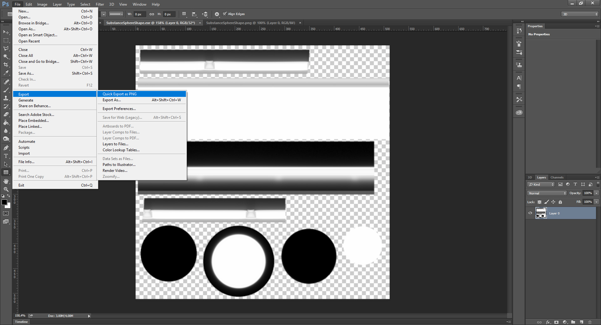](https://viewar.gitbooks.io/sdk-documentation/content/assets/Arnold8.jpg)Open the created PNG in PS and open up "Filter"-&gt;"xNormal"-&gt;"xN Dilation"[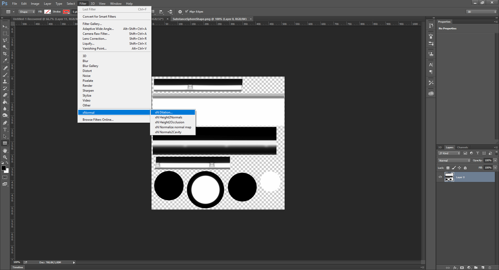](https://viewar.gitbooks.io/sdk-documentation/content/assets/Arnold9.jpg)The standard settings are sufficient. Of course you can use different workflows to add Dilation/Edge Padding to the map, but this is the easiest way to do it for this case, even if it is a bit roundabout. Click on "Do It!" and save the result as "ambientocclusionmap.jpg"[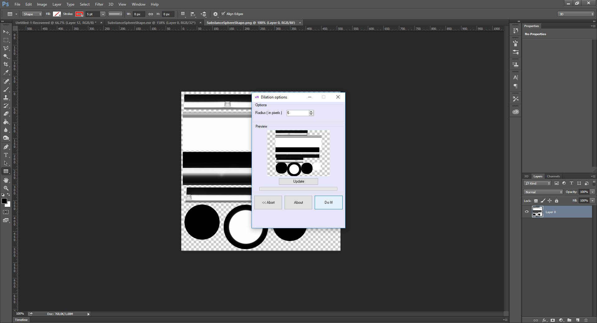](https://viewar.gitbooks.io/sdk-documentation/content/assets/Arnold10.jpg)Next assign a new material to the object and link the texture to check the result of the bake.[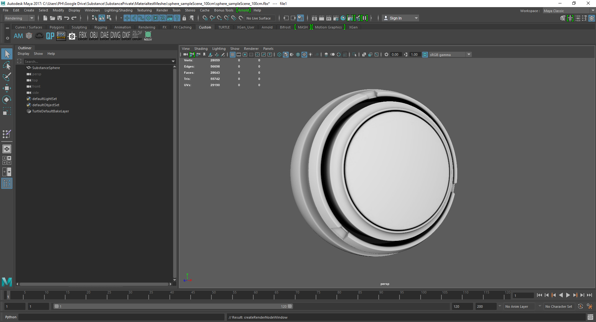](https://viewar.gitbooks.io/sdk-documentation/content/assets/Arnold11.jpg)

#### xNormal

xNormal is a free software that offers a lot of tools mainly focused around baking and converting a variety of essential maps needed for a lot of 3D texturing workflows. In this tutorial we will only focus on baking an ambient occlusion map. You can find xNormal here: [https://xnormal.net/](https://xnormal.net/)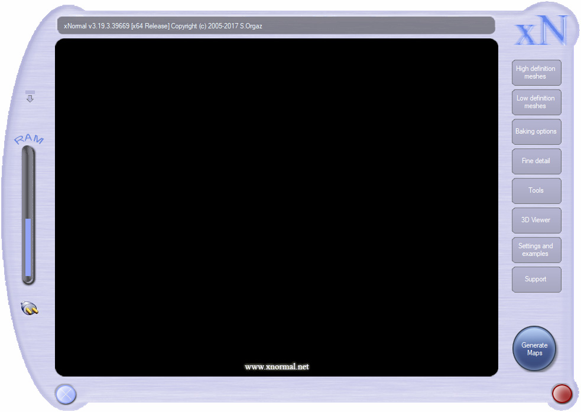xNormal is based around the High- to Low-Poly Model workflow. If you don't have a High-Poly model available, just import the same model as "High definition mesh" and "Low definitions mesh".  
Click on "High definition meshes" and right-click into the window, then click on "Add meshes" and browse for your model.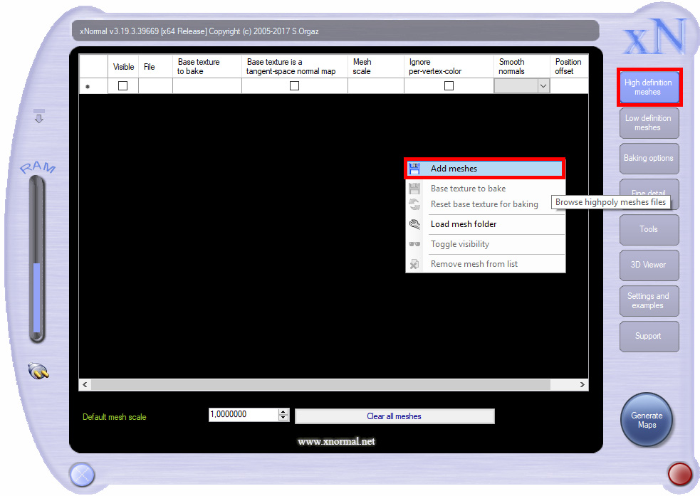Then do the same with "Low definition meshes".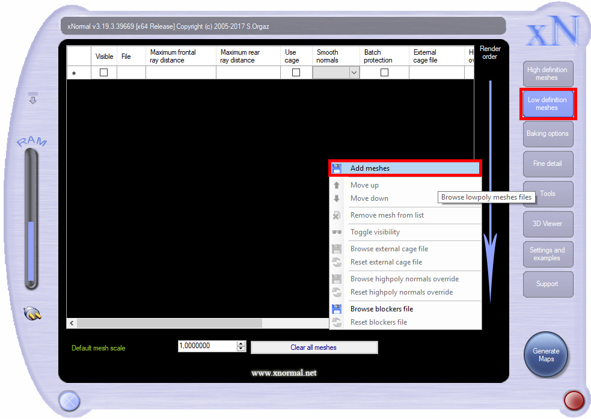Once you imported your meshes the xNormal window should look like this: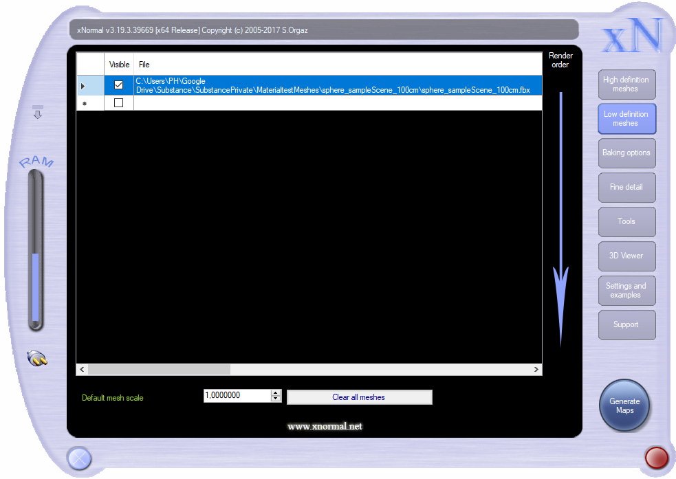Next click on "Baking options" to get to the baking window. Choose the folder you want to save the map to and the file format at "Output File". Set a resolution \(biggest impact on quality and render-time\) and Edge padding. Depending on the resolution it should be between 4 and 16 pixels. The dilation/edge padding should not bleed into other uv shells.  
You can choose between three renderers "Optix/CUDA" is the fastest, but needs a lot more rays for good results than the others. "Open RL" is a lot faster than the standard "Bucket Renderer" and looks almost the same. There are small differences near UV Cuts and hard edges, you'll have to decide yourself which you prefer.  
Check only the "Ambient occlusion" box.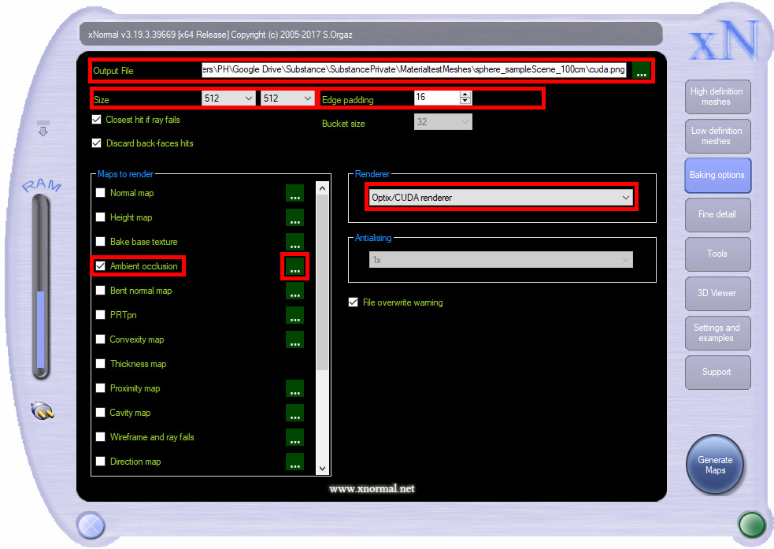Click on the option box on the right of the "Ambient occlusion" box to set up the AO settings. You can change the look of the AO here, the most important setting however is the amount of rays. 512 rays should be enough for most cases, however depending on the resolution the two slower renderers \(Open RL/Bucket\) take a very long time to bake. If you go lower than 512 rays the CUDA renderer will have visible noise in the map.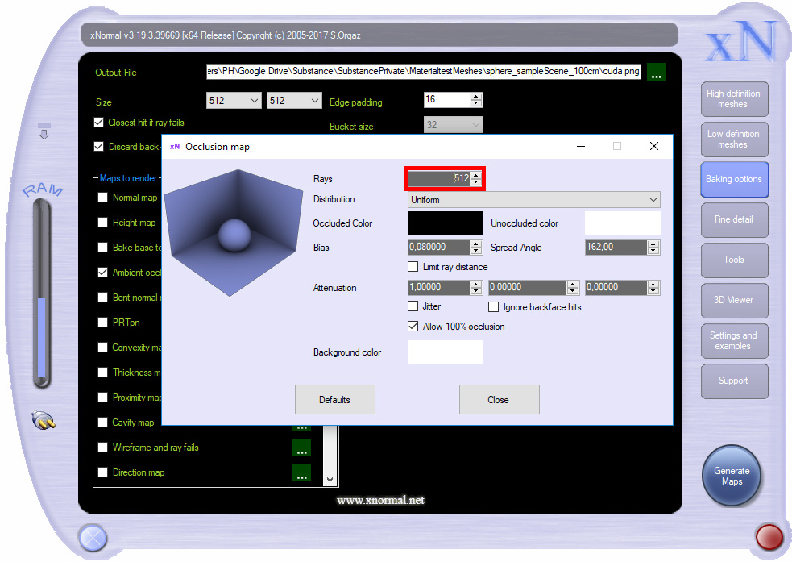After you have set up the baker click on "Generate Maps" to bake. With the stats you can compare render times between the bakers and decide yourself what the best quality/performance balance is for your use cases and the hardware that you have access to.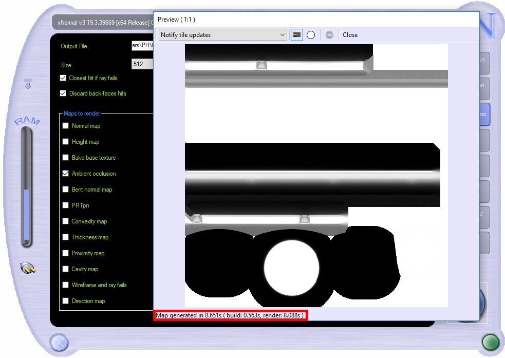

### Animation

For animation in most cases we highly suggest using bone animations. Vertex animations are possible, but have a way higher performance impact. Pretty much all rules that apply to video games apply to us as well. By default we use 24fps for animations in our system.

You can make very complex rigs, but should have a simple rig that you bake the animations onto, otherwise it could result in animations not playing as expected or not at all. This means that if your rig has IK Handles for example, after baking the animation, delete those and then export the fbx with just the simple rig and 3D model.

To bake the animation select all the joints of your simple RIG and then bake the animation.

Animations need to be in one model if you've got multiple animations that should be able to be selected in the app. As an example, the Guidebot has several animations like pointing, waving, idle etc. Those need to be all in one file. You should write down the frame ranges and naming of each animation.
Animations should be in 24fps.
Right now our converter doesn't support animations yet, so we have to manually export them in house. If there are multiple animations we will also need the frame ranges for the animations and the duration of that animation in seconds (in case it should play faster or slower than real-time).

### Export

#### Final touches

- Delete History, Freeze Transformations, set vertex normals to face and assign smoothing groups \(hard, soft edges\). Check for mesh issues with available clean up tools.

- Some History, Inputs and Transformations can have an impact on how the model is converted. For that reason it is recommended to delete the history and freeze all transformations. There are exceptions, though.

  - When a model is animated, you can only delete non-deformer history or you will loose skin weights.

  - Reference cubes or other geometry that is used as a reference for translation or rotation values for the converter shouldn't be frozen or they will loose the values that are important for the Converter. \(See: References/Portals/Snappoints\)

- At the end, set vertex normals to face and issue the smoothing groups \(they get lost when deleting history\).

#### File Formats

The ViewAR System accepts polygon models in 3D files formats of _.fbx_ and _.obj._

##### Export as an .fbx (recommended)

In the export, settings uncheck everything under Include other than “Smoothing groups”. FBX file format may be both binary or ASCII. While ASCII makes debugging easier since it is human readable, binary file would be smaller. Use the 2012 FBX version.

##### Export as an .obj

This is also possible, however, not recommended, since .obj supports only one UV Set and you get better results with our two UV Sets workflow.

#### File Size

It is also important to keep in mind how many objects you want to present in your app. If it's just a few, a long download time because of a complex and detailed object may be okay, however, if you app is to use a lot of models, cutting down the download time becomes crucial. Even more, if the map is to be used on the road, where data fees may apply.

A good default is a 512x512 tiled texture for 25x25cm, but this depends largely for on the usage of the object. An architectural building needs different pixeldensity than a chair.

#### Naming

Don't use any special characters (underscore "\_" is allowed) for mesh-, material-, texture- and filenames.\*\* Keep it short, simple and meaningful.

#### 3DsMax

1\) Create or load any 3D-object\(s\) into your scene

2\) Change the layout to "UV Edit" and switch to "UV Polygons Edit Mode" in the icon palette.

3\) This step is not necessary but will help you to make an optimal use of texture space. If you familiar with the procedure you can skip it. Switch back to "Standard" layout and add a "Connect Object" from the tool bar to the object manager and drag your objects onto it. Open a new texture view \(Window &gt; New Texture View...\). Drag& drop the "Connect Object" onto the new texture window and lock it. This window displays now all UVs overlapping and their changes in the original UV Mesh Editor Window.

4\) Make sure that the UV is shown in the "UV Mesh Editor Window" \(UV Mesh &gt; Show UV Mesh\). Select an object from the "Render Viewport" and apply an optimal UV mapping methode from the "UV Manager".

5\) After unwrapping the meshs you need to create copies of your objects. Simply drag&drop the UVW-tags from the copies to the corresponding objects and delete the copies. Now every object has an additional UVW-tag available. Cinema4D always uses the first UVW-tag for the baking process, so nothing to do here. The second UVW-tag is used for the tileable texture. To set it up just select the UVW-tag and apply an optimal UV mapping methode from the "UV Manager" \(the UV should cover the whole texture window\).

6\) Switch back to "Standard" layout. To bake an ambient occlusion map for all objects in the scene we need to connect them to one single object. Select all objects in the object manager, right click and choose the option "Connect Objects". Select the new created object and start to set up the UV-layout for the ambient occlusion map \(Objects &gt; Bake Objects...\). In the "Bake Object" window activate the following options: Ambient Occlusion, Keep UVs and Single Texture. Change the resolution to 1024 x 1024 pixels and set the file format to "JPEG". After baking the object Cineam4D will automatically duplicate the connected object. Delete all the connected objects and the new created material in the "Material Manager". In case you used the "Connected Object", drag&drop the objects out of it and delete it.\*\*

7\) As we said before, Cinema4D always uses the first UVW-tag for baking the ambient occlusion map. On the contrary to the ViewAR engine, which uses the second UVW-tag for the ambient occlusion map. Therefore we have to switch the order of the two UVW-tags for all objects, so that the secod one contains the UV-layout for the ambient occlusion map and the first one the UV-layout for the tileable texture.

8\) Export your scene in the FBX file format \(File &gt; Export... &gt; FBX... \(\*.fbx\)\)

9\) Rename the image file of the baked ambient occlusion map to "ambientocclusionmap.jpg" and ZIP it together with the FBX-file of your 3D scene.

10\) Login to the [ViewAR Delevoper Portal](https://portal.viewar.com/user/login). Go to the 3D model upload page \(Content &gt; 3D Models &gt; +Upload new model\).

Fill out the form \(Name, Foreign Key, etc.\) and drag&drop the previously created ZIP-file onto the "Model bundle" input field and press "Upload".

11\) After pressing the "Upload" button the ViewAR Material Editor opens automatically.

which is always reserved by ViewAR engine for the ambient occlusion map

#### Cinema 4D

1\) Create or load any 3D-object\(s\) into your scene

2\) Change the layout to "UV Edit" and switch to "UV Polygons Edit Mode" in the icon palette.

3\) This step is not necessary but will help you to make an optimal use of texture space. If you familiar with the procedure you can skip it. Switch back to "Standard" layout and add a "Connect Object" from the tool bar to the object manager and drag your objects onto it. Open a new texture view \(Window &gt; New Texture View...\). Drag& drop the "Connect Object" onto the new texture window and lock it. This window displays now all UVs overlapping and their changes in the original UV Mesh Editor Window.

4\) Make sure that the UV is shown in the "UV Mesh Editor Window" \(UV Mesh &gt; Show UV Mesh\). Select an object from the "Render Viewport" and apply an optimal UV mapping methode from the "UV Manager".

5\) After unwrapping the meshs you need to create copies of your objects. Simply drag&drop the UVW-tags from the copies to the corresponding objects and delete the copies. Now every object has an additional UVW-tag available. Cinema4D always uses the first UVW-tag for the baking process, so nothing to do here. The second UVW-tag is used for the tileable texture. To set it up just select the UVW-tag and apply an optimal UV mapping methode from the "UV Manager" \(the UV should cover the whole texture window\).

6\) Switch back to "Standard" layout. To bake an ambient occlusion map for all objects in the scene we need to connect them to one single object. Select all objects in the object manager, right click and choose the option "Connect Objects". Select the new created object and start to set up the UV-layout for the ambient occlusion map \(Objects &gt; Bake Objects...\). In the "Bake Object" window activate the following options: Ambient Occlusion, Keep UVs and Single Texture. Change the resolution to 1024 x 1024 pixels and set the file format to "JPEG". After baking the object Cineam4D will automatically duplicate the connected object. Delete all the connected objects and the new created material in the "Material Manager". In case you used the "Connected Object", drag&drop the objects out of it and delete it.\*\*

7\) As we said before, Cinema4D always uses the first UVW-tag for baking the ambient occlusion map. On the contrary to the ViewAR engine, which uses the second UVW-tag for the ambient occlusion map. Therefore we have to switch the order of the two UVW-tags for all objects, so that the secod one contains the UV-layout for the ambient occlusion map and the first one the UV-layout for the tileable texture.

8\) Export your scene in the FBX file format \(File &gt; Export... &gt; FBX... \(\*.fbx\)\)

9\) Rename the image file of the baked ambient occlusion map to "ambientocclusionmap.jpg" and ZIP it together with the FBX-file of your 3D scene.

10\) Login to the [ViewAR Delevoper Portal](https://portal.viewar.com/user/login). Go to the 3D model upload page \(Content &gt; 3D Models &gt; +Upload new model\).

Fill out the form \(Name, Foreign Key, etc.\) and drag&drop the previously created ZIP-file onto the "Model bundle" input field and press "Upload".

11\) After pressing the "Upload" button the ViewAR Material Editor opens automatically.

which is always reserved by ViewAR engine for the ambient occlusion map

