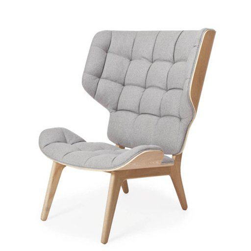
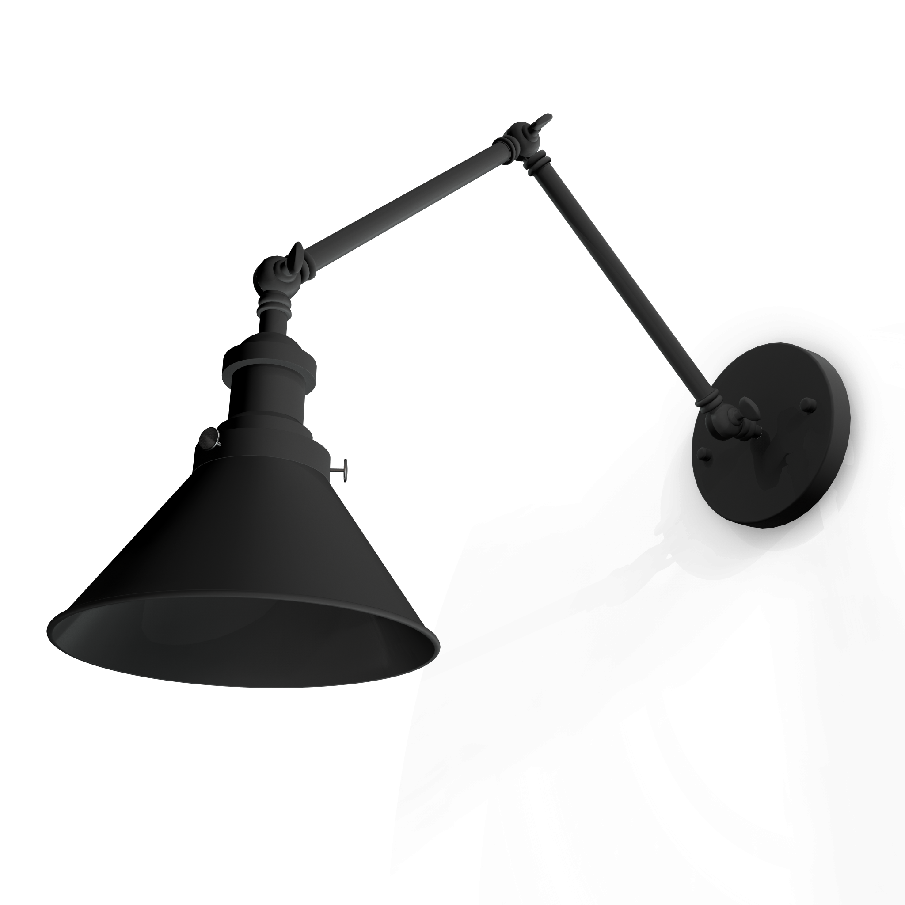
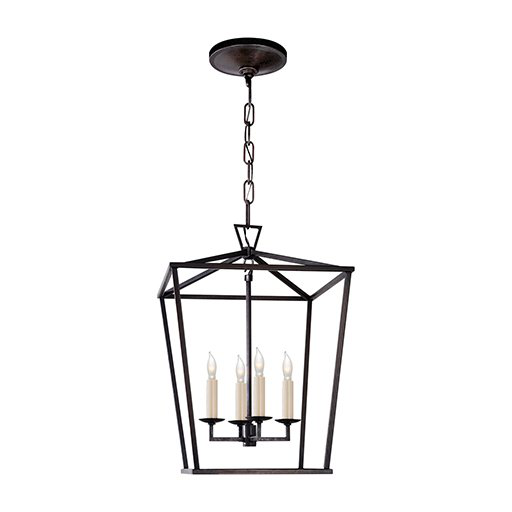

To get you started, our Team has prepared a few Sample Models. Let's play around with one of them, so that you get a grasp of how things work!

## Sample Models
In order to better understand, below you will find a shortlist of sample models prepared by our Team.

### Model types
The ViewAR System supports three distinct model types: floor, wall & ceiling. This property is defined in model data and defines the placement mode.

#### Floor models
Models standing on the floor - chairs, tables, sofas, bikes, but also trees, buildings, people.

_Example: Mammoth Chair_

#### Wall models
Models which can be hang/attached to a wall - lamps, paintings, clocks, TVs, loudspeakers, but also fireplaces and widows. 

_Example: Wall Lamp_

#### Ceiling models
Models attached to the ceiling - lamps, ceiling windows.

_Example: Darlana Ceiling Lamp_

## Edit

### Add to App

In order to add a Sample Model to your application, in the Content Section navigate to the Public Library Tab and import the desired model. Depending on the App Template, the choice may vary.

### Modify

The model's properties like size and materials may be modified in the [Material Editor](./custom_models#Textures).

