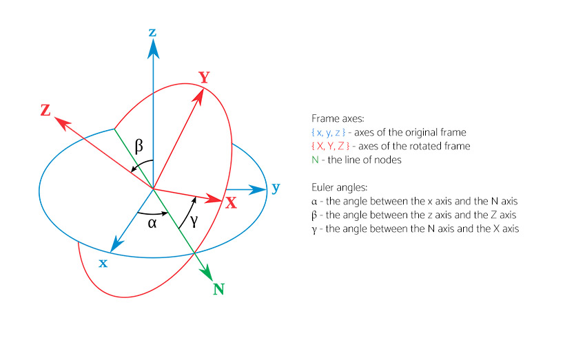

In mathematics, the Euler angles are three angles introduced by Leonhard Euler to describe the orientation of a rigid body with respect to a fixed coordinate system.

Any orientation can be achieved by composing three elemental rotations, i.e., rotations about the axes of a coordinate system. Euler angles can be defined by three of these rotations, typically denoted as:
{ α, β, γ }
{ φ, θ, ψ }
{ yaw, pitch, roll }

#### Geometrical definition

Euler angles between two reference frames may be defined only if both frames have the same handedness. In such a case, the geometrical definition begins by defining the line of nodes (N) as the intersection of the planes xy and XY. Using it, the three Euler angles can be defined as follows:

_Proper (static) Euler angles geometrical definition. Image source: Wikipedia_
