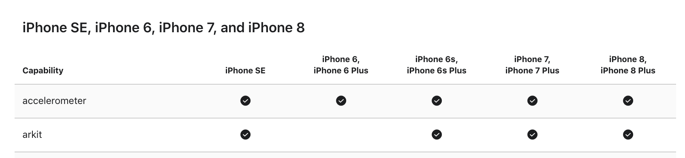

ViewAR applications support both iOS and Android. However, depending on the selected tracking system, some differences in device compatibility might appear.

Generally speaking, the minimal requirement is for the device to be compatible with either ARKit (iOS) or ARCore (Android). Should a more complex tracking solution be chosen (e.g. for object tracking or indoor navigation scenarios), you device needs to be able to run those as well. In such cases, please do not hesitate to [contact us](mailto:support@viewar.com) for all the details.

For the sake of simplicity, check the compatibility according to the lists below.

### iOS 
#### ARKit

ARKit is a robust marker-less tracking system from Apple introduced in 2017. It is available for a variety of iPhones and iPads, starting with iPhone 6s and iPhone s6 Plus.
An overview of compatible devices may be found [here](https://developer.apple.com/support/required-device-capabilities/). In order to identify whether your hardware is suitable for the application, look for the arkit support like in the image below.

_Source: https://developer.apple.com/support/required-device-capabilities/_

### Android
#### ARCore

ARCore is a robust marker-less tracking system from Google released in 2018. It is available for a range of phones and tablets.
A full list of Android ARCore compatible devices may be found [here](https://developers.google.com/ar/discover/supported-devices).

#### More

To learn more about Tracking Systems supported by ViewAR and their more detailed description,  
please refer to our [Basic Concepts of Tracking](/docs/sdk/basic_concepts/tracking).
