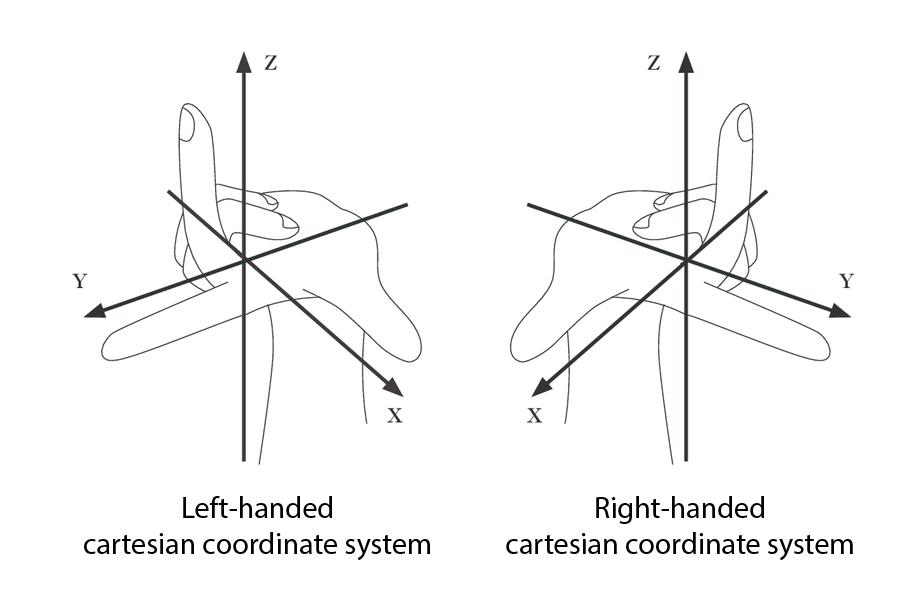

ViewAR applications use the Left-handed Cartesian Coordinate System (see the graphic below).
> Long story short: **the Up-Axis is the Y-Axis!**

The Cartesian coordinate system you are most probably used to is called _Right-handed_, meaning that it follows the right-hand rule. The rule arose from the fact that the three axes of three-dimensional space have two possible orientations.

The ViewAR System uses the Left-handed Cartesian Coordinate System, therefore, keep in mind to verify your export settings and translations applied to the models.

If you are interested in learning more, [this Wikipedia article](https://en.wikipedia.org/wiki/Right-hand_rule) should be a good starting point.
