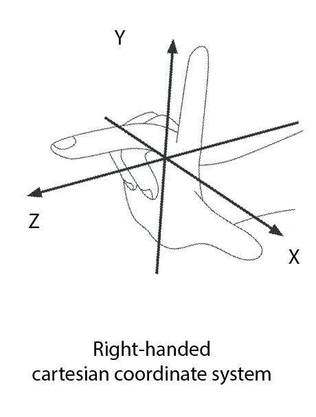

ViewAR applications use the Right-handed Cartesian Coordinate System (see the graphic below).
> Long story short: **the Up-Axis is the Y-Axis!**

The three axes defining the three-dimensional space of the Cartesian Coordinate System have two possible orientations. Therefore, there are two types of the system: Left-handed and Right-handed.

The ViewAR System uses the Right-handed Cartesian Coordinate System, meaning that the x axis goes right, the y axis goes up, and the z axis runs towards you. Keep it in mindand verify your settings before export.

If you are interested in learning more, [this Wikipedia article](https://en.wikipedia.org/wiki/Right-hand_rule) should be a good starting point.
